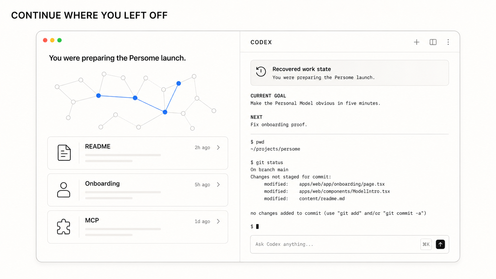
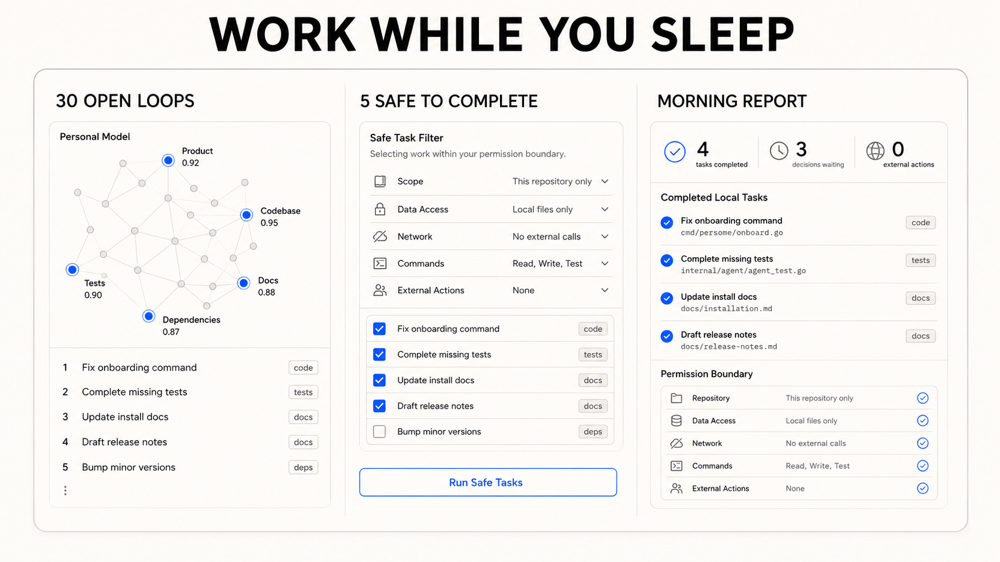
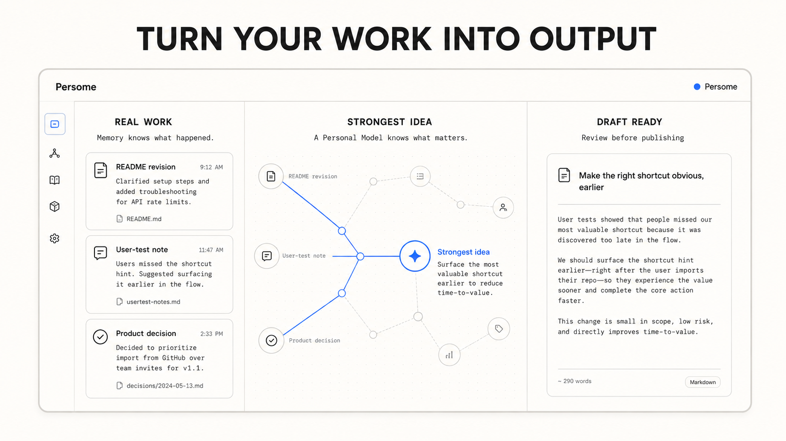
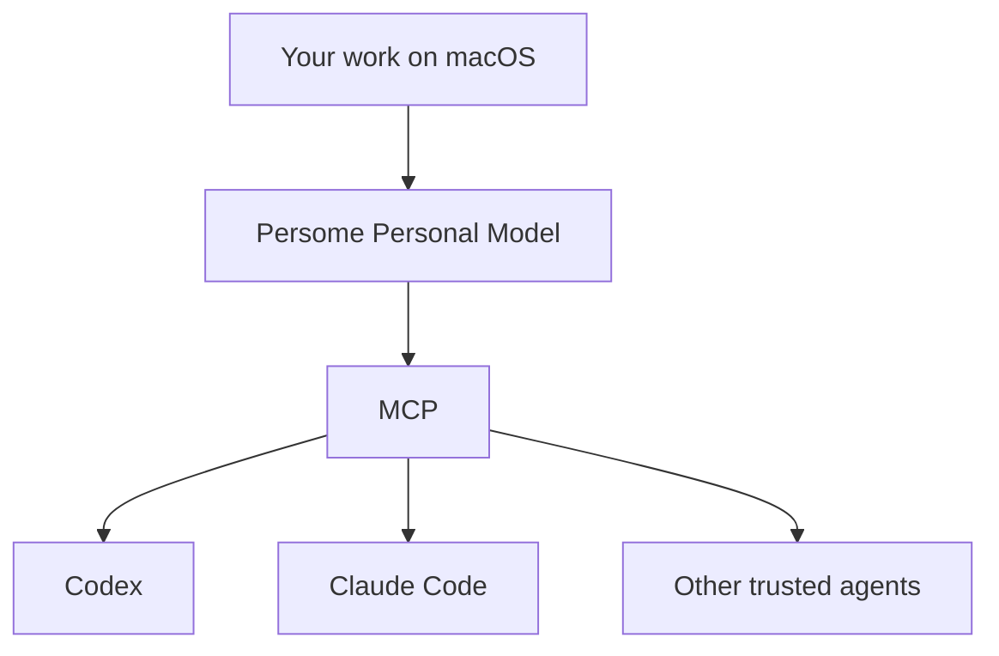
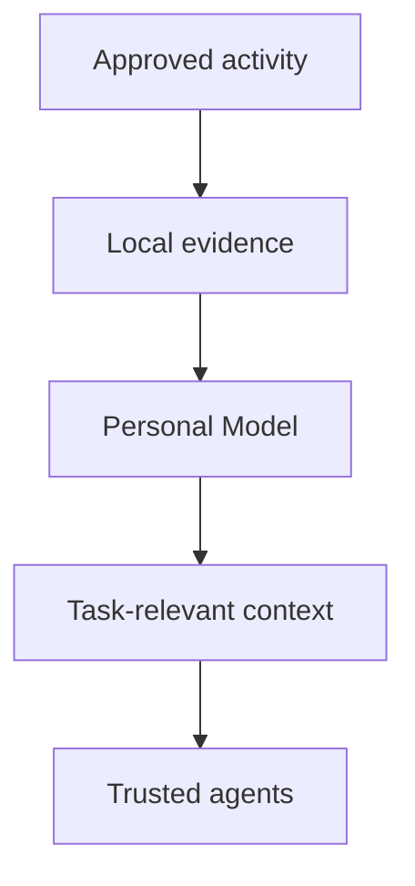

# Build your Personal Model

**The open-source Personal Model that makes every AI yours.**

Persome learns how you actually think and work from approved activity on your Mac—then gives Codex, Claude Code, and any MCP-compatible agent the context to continue your work, understand what matters, and act within your boundaries.

**Local. Private. Yours to inspect, correct, export, and delete.**

[Try the five-minute demo](#five-minute-demo) · [Build yours](#build-yours) · [See the use cases](#use-cases)

---

## What is Persome?

Every new AI agent meets you as a stranger.

Persome turns your work into a local, living, evidence-backed model of your context, decisions, patterns, priorities, and current state.

Think of it as a living `HUMAN.md`—not a profile you maintain by hand, but a model that updates as you work and can be used by every trusted agent.

> **Memory knows what happened. A Personal Model knows what matters next.**

Memory is the evidence. The Personal Model is the product.

Persome currently starts with approved work activity on macOS. The larger vision is a Personal Model that grows with everything you see, say, hear, and do.

---

## Your `HUMAN.md`

Persome connects activity into progressively deeper context:

| Layer | Meaning |
| --- | --- |
| **Point** | A sourced observation or event |
| **Line** | A relationship or change over time |
| **Face** | A pattern supported by related evidence |
| **Volume** | A higher-order structure across projects or areas of life |
| **Root** | The current integrated model of you |

New evidence can strengthen, revise, or overturn an earlier inference. Every important claim keeps receipts.

---

## Use cases

### 1. Continue where you left off

**Start a new agent session without briefing it from zero.**

Persome recovers the goal, decisions, open loops, and next action that still matters—not merely the last thing on screen.



---

### 2. Work while you sleep

**Your agent finds its own work.**

Persome identifies unfinished work, ranks it against your real priorities, and separates safe local tasks from decisions that need you. The connected agent executes; Persome supplies the context and permission boundary.



In an early internal run, a cofounder's agent surfaced 30 possible tasks from recent work and completed the approved local ones overnight. We are turning that result into a reproducible test with the inputs, approvals, outputs, and failures visible.

> The new capability is not that an agent can do work. It is that it can find the right work without another to-do list.

---

### 3. Turn your work into output

**Find the idea hidden inside the work.**

Persome connects your notes, revisions, and decisions to identify the thought worth sharing—then prepares a grounded draft for your review.



Persome drafts. You decide what gets published.

---

## One Personal Model. Every agent becomes yours.

Persome exposes one consistent model through the [Model Context Protocol](https://modelcontextprotocol.io/).



Your agents may change. Your model of you stays the same.

---

## Five-minute demo

See a complete model form without an API key, Accessibility permission, or access to your real data.

Requirements: Git and [`uv`](https://docs.astral.sh/uv/).

```bash
git clone https://github.com/Persome-ai/persome-core.git
cd persome-core
uv run python scripts/sample_demo.py
```

The demo opens the model viewer at `http://127.0.0.1:8743/model` and serves MCP at `http://127.0.0.1:8743/mcp` from a disposable synthetic store.

```bash
# Denser model used for product visuals
uv run python scripts/sample_demo.py --showcase

# Verify the real MCP transport from a second terminal
uv run python scripts/verify_sample_mcp.py
```

The showcase forms **424 Points, 146 Lines, 12 Faces, 4 Volumes, and 1 Root** from synthetic activity. No personal data is used.

---

## Build yours

Requirements: macOS 13+, Apple Silicon or Intel, and Xcode Command Line Tools.

```bash
git clone https://github.com/Persome-ai/persome-core.git
cd persome-core
bash install.sh

persome doctor
persome start
open http://127.0.0.1:8742/model
```

Grant **Accessibility** to the terminal or application that launches Persome:

```text
System Settings → Privacy & Security → Accessibility
```

Accessibility lets Persome read focused text and structure across supported apps. Screen Recording is only needed for optional OCR fallback or screenshot retention. Full Disk Access is not required.

### Connect an agent

```bash
persome install codex
persome install claude-code
```

For another MCP client:

```json
{
  "mcpServers": {
    "persome": {
      "command": "persome",
      "args": ["mcp"]
    }
  }
}
```

Then try:

```text
Continue where I left off. Cite the evidence you used.
```

```text
Find my unfinished work from the last seven days.
Rank it by my current goals. Do not execute anything.
```

---

## How it works



1. **Observe locally** — Persome reads the focused macOS Accessibility tree. Optional local OCR handles surfaces with little structured text.
2. **Structure activity** — It organizes events, projects, entities, and relationships.
3. **Build the model** — Evidence becomes Points, Lines, Faces, Volumes, and one current Root.
4. **Retrieve selectively** — Agents receive the context relevant to the task, with evidence attached.
5. **Keep you in control** — Inferences can be inspected, corrected, exported, or deleted.

| Interface | Endpoint or command |
| --- | --- |
| HTTP MCP | `http://127.0.0.1:8742/mcp` |
| stdio MCP | `persome mcp` |
| Model viewer | `http://127.0.0.1:8742/model` |
| Model export | `persome model export` |

---

## Local-first by design

- Personal data and the model live under `~/.persome` by default.
- Persome binds to `127.0.0.1` and has no cloud account, remote sync, product telemetry, or update phone-home.
- Screenshots are excluded from MCP by default and encrypted at rest when retention is enabled.
- Export is redacted by default.
- External actions always require explicit permission.

Local-first does not mean every configuration is fully offline. Semantic stages may send derived text to the model endpoint you choose, and connected agents follow their own providers' data boundaries.

```bash
# Inspect
persome model status
open http://127.0.0.1:8742/model

# Correct or export
persome correct --help
persome model export

# Delete local modeled memory or all state
persome clean memory
persome clean all
```

---

## Personal Model vs. memory

| Memory | Personal Model |
| --- | --- |
| Retrieves what happened | Models what events mean together |
| Returns facts or snippets | Connects projects, decisions, people, and time |
| Remembers stated preferences | Tests them against behavior and corrections |
| Looks backward | Represents current state and supports next-state research |
| Usually belongs to one app | Works across trusted agents through MCP |

Persome does not claim to replace every adjacent system. Use a screen-history tool for a full searchable archive, a memory API to save and retrieve application facts, and Persome when agents need an evolving, auditable model of the person they work for.

---

## What is proven today

| Claim | Status |
| --- | --- |
| Synthetic activity forms complete model geometry | Deterministic test |
| MCP search returns inspectable receipts | Deterministic test |
| Offline runtime works without a provider key | Covered by the offline test suite |
| Personal relevance and next-state prediction | Human benchmark in progress; no result claimed yet |

The synthetic demo proves the runtime, model formation, receipts, and MCP transport. It does not prove personalization quality on a real person.

---

## Roadmap

- [ ] Reproducible five-minute first-use experience
- [ ] Published evaluation of the three core use cases
- [ ] Richer correction and time controls
- [ ] Safe background execution for local tasks
- [ ] More verified MCP hosts
- [ ] A reproducible Personal Model benchmark

---

## Contributing

Persome is early. We welcome reproducible use cases, MCP integrations, evaluation tasks, privacy reviews, macOS improvements, and honest failure reports.

Read [`CONTRIBUTING.md`](CONTRIBUTING.md), [`SECURITY.md`](SECURITY.md), and [`SUPPORT.md`](SUPPORT.md). Persome Runtime is licensed under [Apache 2.0](LICENSE).

---

## Why Persome

Models will keep getting smarter. Agents will keep gaining more tools.

But an agent also needs a model of the person it works for: what they have experienced, how everything connects, what they value, and what matters now.

That model should live with the person—not inside one company's assistant.

**Build your `HUMAN.md`. Give every agent a model of you.**

[Star Persome on GitHub](https://github.com/Persome-ai/persome-core)
