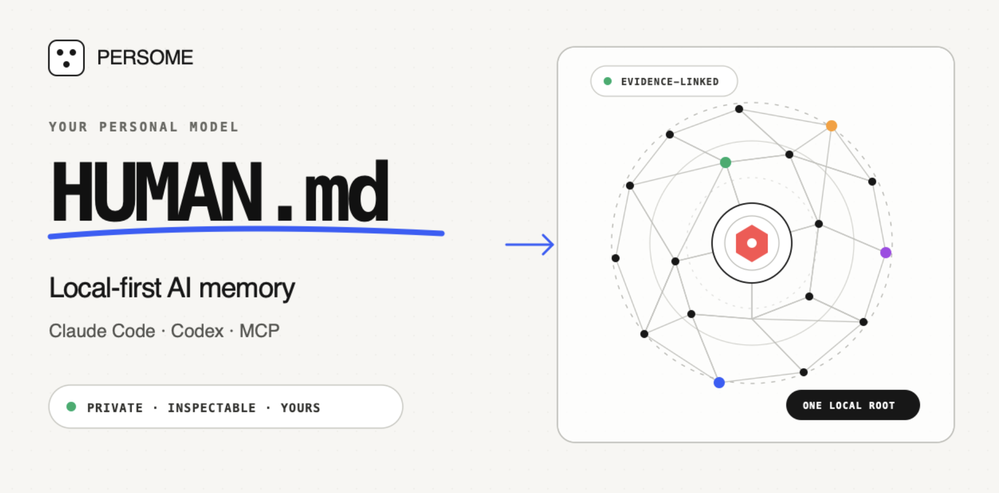
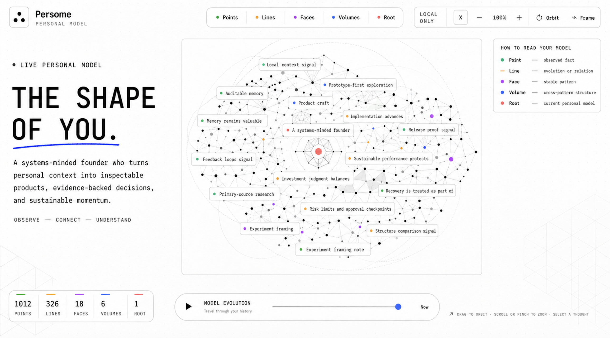
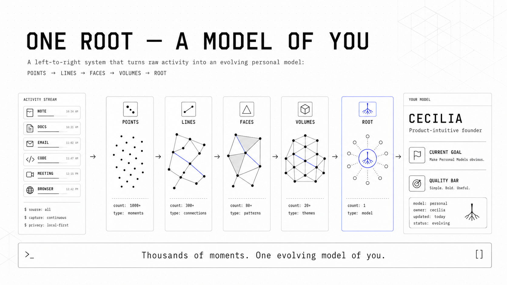
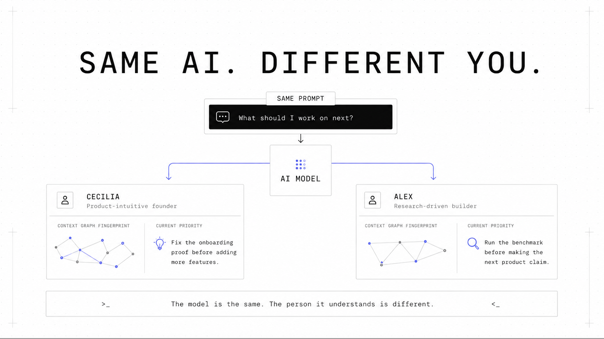
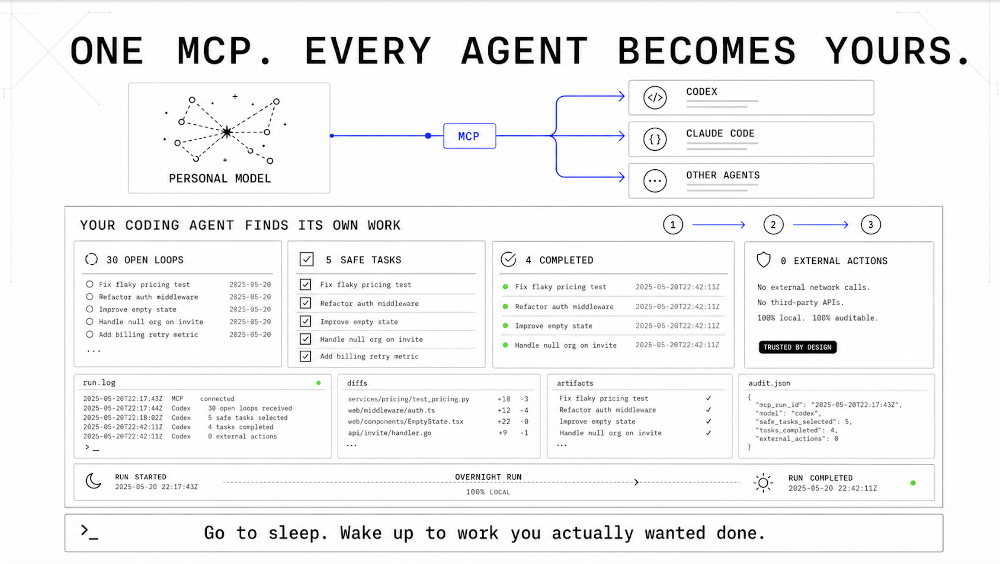
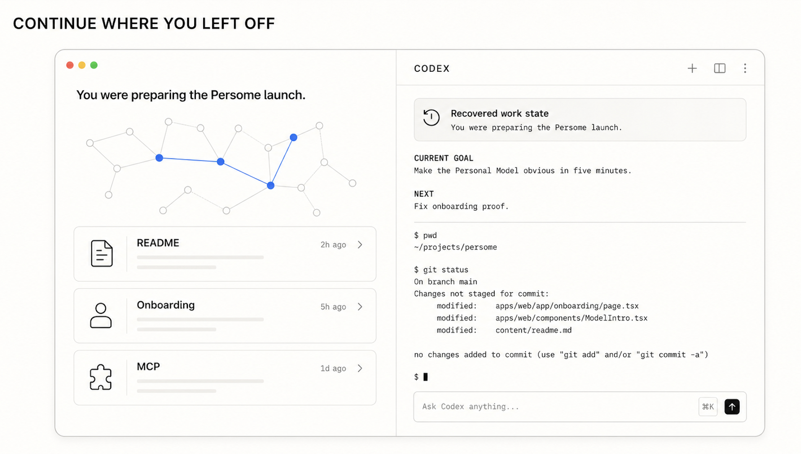
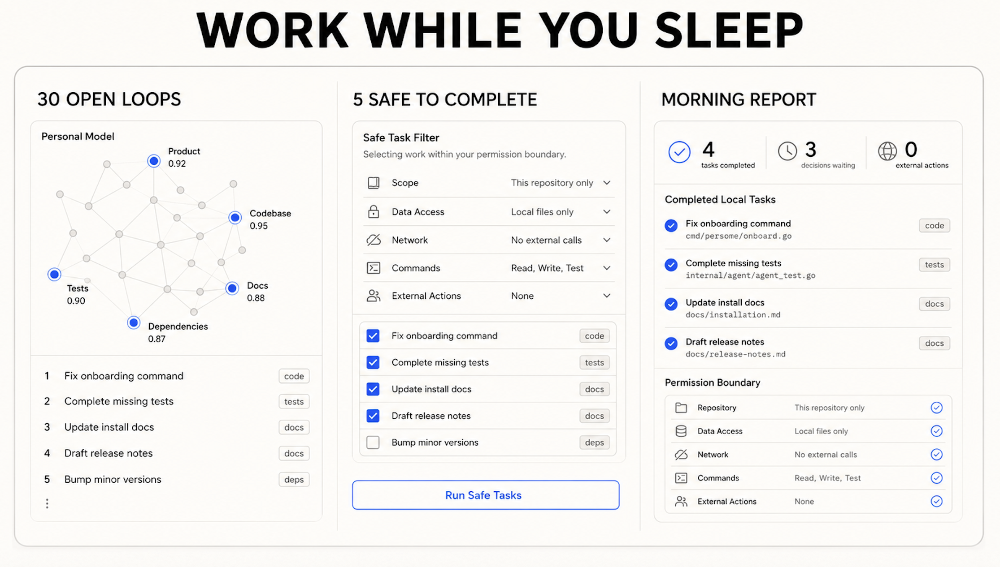
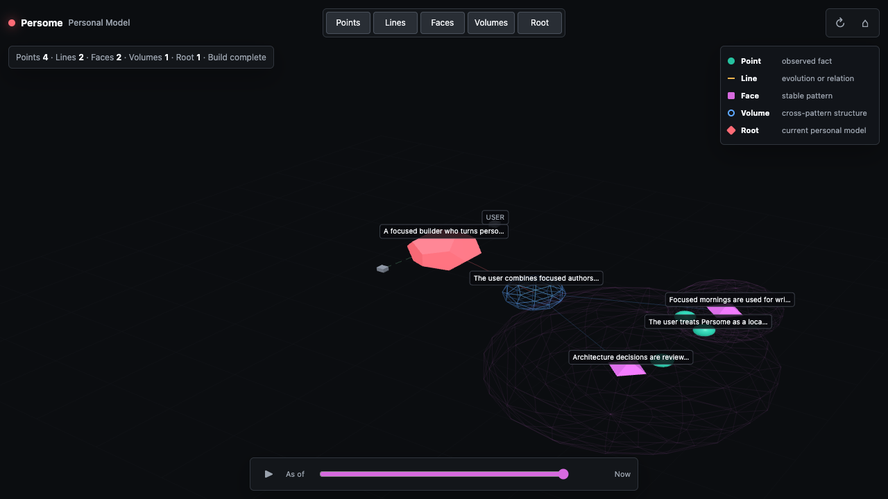

# Personal Model: local-first AI memory for coding agents

<p align="center">
  <a href="https://github.com/Intuition-Lab/personal-model/releases/download/v0.3.2/demo.mp4"><strong>▶ Watch the Personal Model demo</strong></a>
</p>

<!-- mcp-name: io.github.Intuition-Lab/personal-model -->



Build your `HUMAN.md` — one evidence-linked Personal Model for Claude Code, Codex, Cursor Agent, and other trusted MCP clients.

Personal Model is an open-source, local-first long-term memory Runtime. It learns how you think and work from focused activity captured on your Mac after you grant macOS permission, then gives your AI tools inspectable context to continue work and make grounded decisions.

**Runs locally on your Mac. Private by default. Yours to inspect, correct, export, and delete.**

[](https://github.com/Intuition-Lab/personal-model/actions/workflows/ci.yml) [](https://github.com/Intuition-Lab/personal-model/releases) [](https://github.com/Intuition-Lab/personal-model) [](LICENSE) [](#2-install-with-your-data) [](MCP.md) [](https://registry.modelcontextprotocol.io/?q=personal-model)

[Try the five-minute demo](#1-five-minute-synthetic-demo) · [Install Personal Model](#2-install-with-your-data) · [Connect your AI tool](#works-with-claude-code-codex-cursor-agent-and-mcp-clients) · [Star Personal Model on GitHub](https://github.com/Intuition-Lab/personal-model)



_Concept illustration of a mature Personal Model. The deterministic Runtime proof is shown in the demo below._

---

## Why Personal Model

Personal Model turns focused activity from the apps you use into a portable context layer, keeps it on your Mac, and makes it available to the trusted AI clients you choose.

- **One memory across agents.** Connect the same Personal Model to Claude Code,
  Codex, Cursor Agent, and other MCP-compatible clients.
- **Evidence, not hidden summaries.** Important claims retain source receipts;
  new evidence can strengthen, revise, or overturn an earlier inference.
- **User-owned by design.** Inspect, correct, export, or delete your model and
  data without depending on a hosted memory service.
- **More than chat history.** Personal Model learns from focused activity after you
  explicitly grant macOS permissions.

### Your Personal Model is your `HUMAN.md`

Personal Model connects activity into progressively deeper context:

| Layer | Meaning |
| --- | --- |
| **Point** | A sourced observation or event |
| **Line** | A relationship or change over time |
| **Face** | A pattern supported by related evidence |
| **Volume** | A higher-order structure across projects or areas of life |
| **Root** | The current integrated model of you |

The result is a living model of what matters now, how you tend to decide, and
where your attention is moving.

## Works with Claude Code, Codex, Cursor Agent, and MCP clients

| Client | Connection | Setup |
| --- | --- | --- |
| [Claude Code](docs/mcp-clients.md#claude-code) | Native Personal Model installer | `persome install claude-code` |
| [Codex CLI and IDE extension](docs/mcp-clients.md#codex-cli-and-ide-extension) | Native Personal Model installer | `persome install codex` |
| [Cursor Agent CLI](docs/mcp-clients.md#cursor-agent-cli) | Native Personal Model installer | `persome install cursor-agent` |
| [Claude Desktop](docs/mcp-clients.md#claude-desktop) | Managed stdio config | `persome install claude-desktop` |
| [opencode](docs/mcp-clients.md#opencode) | Managed local stdio config | `persome install opencode` |
| [Other compatible clients](docs/mcp-clients.md#generic-clients) | Generated MCP JSON | `persome install mcp-json --filename persome-mcp.json` |

The [MCP client guide](docs/mcp-clients.md) covers prerequisites, verification,
the permission boundary, transport details, HTTP fallback, and troubleshooting.

> Personal Model is an MCP server used by trusted MCP clients. Other MCP servers—such
> as Filesystem, GitHub, Slack, or Google Drive—are separate tools and are not
> Personal Model integrations unless that path is explicitly built and tested.

## Use cases

> These visuals show agent workflows enabled by Personal Model. The Runtime
> supplies evidence-linked local context through MCP; connected agents own task
> selection and execution, and external actions still require your authority.

### 1. One Root — A Model of You

**Thousands of moments. One evolving model of you.**

Personal Model turns sourced observations into relationships, patterns, higher-order structure, and one current Root: what matters now, how you tend to decide, and where your attention is moving.

<p align="center"></p>

From Points to Lines, Faces, Volumes, and one Root—a living model of who you are and what matters now.

### 2. Same AI. Different You.

<p align="center"></p>

**The model is the same. The person it understands is different.**

Two people can give the same AI the same prompt and deserve different answers. Your Personal Model changes how an agent prioritizes, decides, writes, and acts—because it understands who it is working for.

The same prompt should not produce the same answer for everyone. Give AI a model of you.

### 3. One MCP — Turn coding agents into proactive agents

<p align="center"></p>

**Your coding agent finds its own work**

Connect Personal Model once through MCP. Codex, Claude Code, and other trusted agents can use the same model of your goals, priorities, working patterns, and boundaries.

A connected agent can search Personal Model for unfinished work, rank proposed
next steps against your priorities, and separate local implementation from
external actions that need your approval.

#### Continue where you left off

<p align="center"></p>

#### Work while you sleep

<p align="center"></p>

## Install, connect, and verify

**Choose the path that matches what you want to prove.** The synthetic demo and the real-data install are intentionally separate.

### 1. Five-minute synthetic demo

Try the complete model without touching your personal data. This path requires
Git and [uv](https://docs.astral.sh/uv/getting-started/installation/), but no API
key, macOS Accessibility permission, or access to your existing `~/.persome`
data.

```text
git clone https://github.com/Intuition-Lab/personal-model.git
cd personal-model
uv run python scripts/sample_demo.py
```

The script opens the local viewer at `http://127.0.0.1:8743/model` and deletes its temporary synthetic data when you press `Ctrl-C`. Add `--showcase` for the denser, still fully synthetic graph shown below.



_Actual `/model` screenshot produced by `scripts/sample_demo.py --showcase`: 424 synthetic Points, 146 Lines, 12 Faces, 4 Volumes, and 1 Root. It contains no personal data._

### 2. Install with your data

Requirements: macOS 13 or newer and Xcode Command Line Tools. For the shortest package-managed installation:

```text
uv tool install personal-model
persome onboard
persome model open --after 30
```

The distribution is named `personal-model`; the installed CLI is `persome`.

For the most explicit source-based first run:

```text
git clone https://github.com/Intuition-Lab/personal-model.git
cd personal-model
bash install.sh
```

After successful interactive onboarding, the source installer opens the unified
local setup experience immediately.

**What onboarding proves**

- `persome onboard` explains each macOS request before it appears.
- Accessibility is granted to the versioned `mac-ax-helper` and, only when event-driven capture is enabled, `mac-ax-watcher`.
- Screen Recording is requested only when the effective screenshot or local-OCR policy requires pixels. Personal Model never requires Full Disk Access.
- On Apple Silicon, local OCR uses bundled PP-OCRv6; on Intel, it uses the macOS
  Apple Vision framework. Onboarding verifies the isolated worker on both architectures.
- Unified localhost onboarding offers a read-only, multi-source import and builds the first model
  from existing Markdown history. Local folders are always available; Obsidian
  and Notion appear only when detected on the Mac. The same sources remain
  available through `persome import-data`; see [the import guide](docs/importing.md).
- It proves the final lifecycle owner and Runtime generation, then reports a fresh-capture receipt in standard daemon mode or an explicit readiness/privacy receipt for supported alternate modes such as trusted ingest.

An LLM is optional for collection and BM25 recall, but required for semantic modeling. You can configure a hosted/local provider for unattended processing:

```text
persome llm setup
persome llm status --check
```

Alternatively, explicitly lend an existing coding-agent subscription to the
background Runtime. The client CLI keeps and refreshes its own login; Personal Model
stores only its executable path, routing policy, and a durable daily call cap:

```text
persome llm agent setup --client codex --daily-call-limit 50 --check
# also supported: claude-code, cursor-agent
persome llm status
```

A trusted MCP client that supports Sampling with tools can still call
`process_pending_model_work` for a one-request, 1–10-session batch. Both paths
use the connected agent allowance without exposing its OAuth token to Personal Model;
the CLI bridge is the opt-in path that also powers unattended stages.

### 3. Connect a trusted MCP client

Register whichever owner-local clients you use:

```text
persome install claude-code
persome install codex
persome install cursor-agent
persome install claude-desktop
persome install opencode
```

The commands above install only the MCP server. To also give background
semantic stages explicit consent to use a supported coding-agent subscription,
add `--fund-model`; the default cap is 50 model invocations per local day:

```text
persome install codex --fund-model --daily-call-limit 50
# also supported: claude-code, cursor-agent
```

`persome llm agent disable` revokes that consent without logging the client out
or deleting a fallback provider profile.

These stdio registrations launch the MCP process on demand, so the daemon does
not need to be running after onboarding has initialized the local database, and
no HTTP bearer is copied into client configuration. Schema creation and
migration remain daemon-owned; a brand-new or externally upgraded data root
must run `persome start` once before stdio clients use it. Stdio writes remain
available while the daemon is stopped, but WAL maintenance waits for the daemon;
start it periodically if you use write tools in that mode so the WAL stays bounded.

For another Cursor-compatible setup, you can still generate a stdio object and
merge `mcpServers.persome` manually:

```text
persome install mcp-json --filename persome-mcp.json
```

> MCP access is a personal-data capability; register only clients you trust.

### 4. Verify and ask grounded questions

```text
persome status
persome model status
persome model open

# Only if you configured a semantic provider:
persome llm status --check
```

A sparse or degraded model can be valid early; Personal Model reports missing geometry instead of fabricating Faces, Volumes, or a Root.

After connecting an MCP client, try one of these recipes:

> Search my Personal Model for **[topic]**. Use `search`, open the strongest result with `read_receipt`, and cite the source path, timestamp, and receipt ID. If the evidence is missing or conflicting, say so instead of guessing.

> Help me continue where I left off on **[project]**. Search recent Personal Model context, distinguish observed facts from inferences, and show the receipts behind the proposed next step.

> Review my current Personal Model with `get_model_snapshot`. Summarize my active priorities and unresolved work, cite supporting evidence, and call out anything sparse, stale, or conflicted.

Active work is reduced every five minutes by default. With valid capture and a working semantic provider, a first useful recall is operationally expected within about ten minutes—not guaranteed as a benchmark result.

### 5. Update Personal Model

For a `uv tool` installation, upgrade with the package manager and re-run Runtime proof:

```text
uv tool upgrade --python 3.12 personal-model
persome onboard
persome model open --after 30
```

After any upgrade, restart editors that host a Personal Model stdio MCP process before
resuming Runtime writes. A process loaded from the previous release cannot join
the new cross-process SQLite maintenance gate until the editor reconnects it.

For an installation created by `install.sh`, run the transactional updater from any directory:

```text
persome update
```

`persome update` preserves configuration, credentials, personal data, capture policy, and lifecycle intent, and performs its own mode-aware onboarding before committing the update. Do not use it to update a package-manager-managed installation.

---

## Recipes

- [Use Personal Model with Claude Code](docs/mcp-clients.md#claude-code)
- [Use Personal Model with Codex CLI and the IDE extension](docs/mcp-clients.md#codex-cli-and-ide-extension)
- [Use Personal Model with Cursor Agent](docs/mcp-clients.md#cursor-agent-cli)
- [Use Personal Model with Claude Desktop](docs/mcp-clients.md#claude-desktop)
- [Use Personal Model with opencode](docs/mcp-clients.md#opencode)
- [Connect any compatible MCP client](docs/mcp-clients.md#generic-clients)

Use the client guide with the prompts above to install, prove the connection,
test evidence-grounded retrieval, understand the permission boundary, and
diagnose the most common failures.

## Where Personal Model fits

Personal Model is an owner-local macOS Runtime, not a hosted multi-tenant memory
service or only a graph library. It can coexist with product-native memory in
ChatGPT or Claude and with developer memory infrastructure.

[Read the Runtime boundary](ARCHITECTURE.md) and
[evaluation limits](docs/benchmarks.md#what-is-not-measured-here) before
treating this as a hosted service or a benchmark claim.

## Privacy, ownership, and evidence

- Personal Model runs owner-locally on macOS and captures activity only after the
  relevant permissions are explained and granted.
- Important memories and model objects retain provenance that trusted clients
  can inspect with `read_receipt` and `resolve_evidence`.
- Corrections preserve audit history. Exports are redacted by default, and
  explicit erasure commands are available when history itself must be deleted.
- MCP access is access to personal data. Register only clients you trust, and
  do not expose the localhost Runtime through a public tunnel.

Read the complete [security and privacy model](SECURITY_PRIVACY.md),
[model and evidence contract](MODEL_FORMAT.md), and [MCP tool contract](MCP.md).

## Help us test more MCP clients

If your client is not listed above, start with the
[generic MCP setup](docs/mcp-clients.md#generic-clients). If it works, open an
[issue](https://github.com/Intuition-Lab/personal-model/issues) with the client
name, version, transport, verification steps, and any permission caveats. A
client moves into the verified table only after the path is reproducible.

See [CONTRIBUTING.md](CONTRIBUTING.md) for the development workflow and DCO
requirements.

## Star History

[View Personal Model's growth on Star History](https://www.star-history.com/#Intuition-Lab/personal-model&Date) or
[star the repository](https://github.com/Intuition-Lab/personal-model) to follow
new Runtime and MCP releases.

<!-- A live chart embed now requires repository-owner-generated sealed-token code. -->

---

<p align="center"><a href="https://github.com/Intuition-Lab/personal-model"><b>Star Personal Model on GitHub</b></a> · <a href="https://registry.modelcontextprotocol.io/?q=personal-model">Official MCP Registry</a> · <a href="https://github.com/Intuition-Lab/personal-model/blob/main/docs/mcp-clients.md">MCP client setup</a> · <a href="https://github.com/Intuition-Lab/personal-model/blob/main/SECURITY_PRIVACY.md">Security &amp; privacy</a></p>

<details>
<summary>Contributors</summary>

<!-- ALL-CONTRIBUTORS-LIST:START - Do not remove or modify this section -->
<table>
  <tbody>
    <tr>
      <td valign="middle">
        <a href="https://github.com/Singularity-tian"></a>
        &nbsp;&nbsp;<strong><a href="https://github.com/Singularity-tian">Singularity</a></strong><br />
        &nbsp;&nbsp;<sub>💻&nbsp;Code</sub>
      </td>
      <td valign="middle">
        <a href="https://github.com/GouBuliya"></a>
        &nbsp;&nbsp;<strong><a href="https://github.com/GouBuliya">Li_Xufeng</a></strong><br />
        &nbsp;&nbsp;<sub>💻&nbsp;Code</sub>
      </td>
      <td valign="middle">
        <a href="https://github.com/SiyiZhu1"></a>
        &nbsp;&nbsp;<strong><a href="https://github.com/SiyiZhu1">Siyi</a></strong><br />
        &nbsp;&nbsp;<sub>🎨&nbsp;Design</sub>
      </td>
    </tr>
    <tr>
      <td valign="middle">
        <a href="https://github.com/kevinaimonster"></a>
        &nbsp;&nbsp;<strong><a href="https://github.com/kevinaimonster">Kevin</a></strong><br />
        &nbsp;&nbsp;<sub>💻&nbsp;Code</sub>
      </td>
      <td valign="middle">
        <a href="https://github.com/huachenjie238-oss"></a>
        &nbsp;&nbsp;<strong><a href="https://github.com/huachenjie238-oss">huachenjie238-oss</a></strong><br />
        &nbsp;&nbsp;<sub>📈&nbsp;Growth</sub>
      </td>
      <td valign="middle">
        <a href="https://github.com/JingYangGit"></a>
        &nbsp;&nbsp;<strong><a href="https://github.com/JingYangGit">Jing@Meowy</a></strong><br />
        &nbsp;&nbsp;<sub>📈&nbsp;Growth</sub>
      </td>
    </tr>
    <tr>
      <td valign="middle">
        <a href="https://github.com/AMTso7aw"></a>
        &nbsp;&nbsp;<strong><a href="https://github.com/AMTso7aw">Zhiheng Chen</a></strong><br />
        &nbsp;&nbsp;<sub>💻&nbsp;Code</sub>
      </td>
    </tr>
  </tbody>
</table>
<!-- ALL-CONTRIBUTORS-LIST:END -->

</details>
