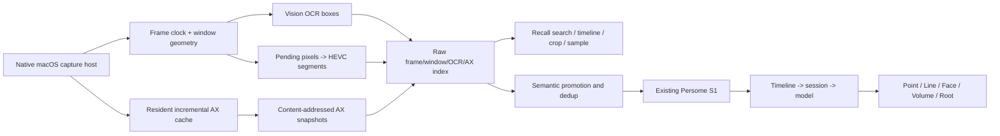

# Coast functional parity: gap and schedule

> Snapshot date: 2026-07-30. Persome evidence is pinned to public Runtime commit
> `1caab28a76846caaf11fd3b19bf6f1b371e312d9`. Coast evidence is pinned to
> Coast Local 1.0 build 131000 and the accompanying
> [reverse-engineering report](./coast-local-1.0-build-131000-reverse-engineering.md).
> The estimates below are planning ranges, not delivery commitments.

## Bottom line

Persome is not one capture-interval change away from Coast. It already has much
of the semantic memory, provenance, correction, authentication, and agent
integration layer, but it does not yet have Coast's dense raw visual-recall
substrate or its native consumer product shell.

The most realistic calendar ranges are:

| Target | Suggested team | Cumulative calendar time | Acceptance boundary |
|---|---:|---:|---|
| Convincing demo | 3 engineers plus part-time design | 8–10 weeks | Native menu bar, roughly two-second pixels, searchable OCR/screenshots, basic timeline, pause, and agent handoff; short retention and transitional storage are acceptable |
| Daily-driver product | 4–5 engineers plus design/QA | 4–6 months | Native capture host, scalable media archive, useful search/timeline, exclusions and retention controls, signed/notarized install, login start, update, and measured resource budgets |
| Stable near-1:1 functional parity | 5–7 cross-functional contributors | 8–12 months | 30/90-day soak, browser and display edge cases, migration and crash recovery, stable TCC identity, polished native UX, and release-grade compatibility testing |

A single strong engineer should plan for roughly 12–18 months. Literal
pixel-for-pixel and edge-behavior parity would also require deeper
function-level reverse engineering and dynamic comparison; reserve another
2–3 months and approximately 30% uncertainty for that interpretation of
"1:1".

The recommended target is not literal cloning. It is:

> Coast-equivalent low-friction raw recall, underneath Persome's stronger
> evidence-linked personal model and privacy boundary.

## What "1:1" includes

This assessment treats parity as a complete daily-use loop, not as one API or
one screenshot function:

1. continuous native pixel capture;
2. window geometry, browser context, OCR boxes, and AX evidence aligned to the
   same logical frame;
3. compact long-lived pixels plus separately retained searchable text;
4. raw timeline, search, crop, sampling, and usage retrieval;
5. native menu-bar, timeline, evidence, settings, and agent handoff UX;
6. exclusions, pause policies, retention, and real egress control;
7. signed installation, stable permissions, update, recovery, and sustained
   resource budgets.

Coast Full, server sync, and any unobserved private service are outside the
scope. The product surface reconstructed here is the installed Lite build.

## Current position

The gap is asymmetric:

- **Persome is ahead or structurally stronger** in modeled personal context,
  evidence receipts, correction and forgetting, authenticated local APIs,
  fail-closed encrypted screenshot persistence, and multi-client MCP
  installation.
- **Persome is materially behind** in dense pixel capture, persistent AX graph
  construction, frame geometry, scalable media storage, raw-history retrieval,
  native product UX, privacy controls, packaging, and real-Mac endurance
  validation.
- **The products optimize different layers.** Coast is primarily a
  high-resolution recall index. Persome is a local daemon that promotes
  observations into Point, Line, Face, Volume, and Root. The Runtime explicitly
  excludes product dashboards from its current ownership boundary
  ([`AGENTS.md`](../../AGENTS.md#L8-L22)).

Consequently, a single percentage would be misleading. Persome has reusable
building blocks in most layers, but the user-visible Coast-like raw recall
product is much less complete than the semantic model behind it.

## Technical gap matrix

| Capability | Persome now | Coast parity gap | Assessment |
|---|---|---|---|
| Capture clock | AX-event driven with a ten-minute heartbeat. Two seconds is the minimum gap between accepted events, not a fixed frame cadence ([config](../../src/persome/config.py#L35-L46)). | A stable approximately two-second pixel timeline, independent of semantic AX changes | Major |
| Visual-change preservation | Consecutive dedup uses app, title, focused text, visible text, and URL; pixels and raw AX are not part of the fingerprint ([scheduler](../../src/persome/capture/scheduler.py#L785-L806)). | Video, canvas, image, animation, and other pixel-only changes must remain recallable | Major |
| Pixel acquisition | `mss` captures the primary display and encodes JPEG ([screenshot](../../src/persome/capture/screenshot.py#L22-L62)). | Long-lived ScreenCaptureKit producer, display/window geometry, multi-display policy, native frame clock, and visual backpressure | Major |
| Window model | AppleScript obtains the front application, title, and bundle; a focused-window crop is used transiently for OCR ([window metadata](../../src/persome/capture/window_meta.py#L16-L62), [window screenshot](../../src/persome/capture/window_screenshot.py#L25-L87)). | All visible windows, bounds, layer/z-order, display coordinates, occlusion, and foreground/background grouping | Major |
| AX observation | A resident Swift watcher already observes activation, focus, value changes, typing, and clicks. Each accepted capture then launches a separate focused-window helper and walks a fresh tree ([AX capture](../../src/persome/capture/ax_capture.py#L381-L450), [capture order](../../src/persome/capture/scheduler.py#L332-L369)). | Resident incremental AX cache, dirty-subtree splice, content-addressed node/edge/snapshot storage, completeness and freshness metadata, rebuild and crash recovery | Major, but watcher is reusable |
| Pixel/AX alignment | One observation sequentially records a timestamp, metadata, AX, and screenshot. | Explicit frame clock, time-skew measurement, snapshot ID, freshness, completeness, and shared coordinate system; the Coast pairing itself is logical rather than atomic | Moderate to major |
| OCR | Local isolated OCR can produce text, boxes, and confidence. It runs only when focused-window AX content is weak and is throttled; the persisted capture keeps flattened text rather than boxes ([OCR scheduling](../../src/persome/capture/scheduler.py#L60-L69), [OCR backfill](../../src/persome/capture/scheduler.py#L106-L155)). | Per-frame or change-driven OCR across relevant windows, persistent boxes, foreground/background classification, and geometry-aware search/crop | Moderate |
| Raw persistence | One JSON file per observation, with an encrypted base64 JPEG when pixels are retained; default screenshot stripping is 24 hours, raw capture deletion is seven days, and the default buffer cap is 2 GB ([config](../../src/persome/config.py#L47-L66), [write path](../../src/persome/capture/scheduler.py#L695-L747)). | Pending image queue, HEVC segments, logical frame-to-video index, normalized frame/window/OCR/AX schema, and independently configurable pixel/text lifetimes | Architectural |
| Text search | SQLite FTS5/BM25 already supports snippets, time ranges, and application filtering ([schema](../../src/persome/store/fts.py#L266-L346), [query](../../src/persome/store/fts.py#L2128-L2182)). | Normalized domain and bundle filters, app/domain catalogs and usage, window/OCR-region filters, segment coverage, and representative-frame sampling | Moderate |
| Raw evidence API | MCP exposes `current_context`, `search_captures`, and `read_recent_capture`; screenshot and full AX are explicit opt-ins ([capture read](../../src/persome/mcp/captures.py#L161-L295), [search](../../src/persome/mcp/captures.py#L301-L386)). | OCR boxes, historical crop/export, AX attribute queries, app/domain usage, current-screen image, segment sample/cover, and a dedicated low-latency raw-query surface | Moderate |
| Timeline UI | The current `/model` viewer renders modeled geometry and model evolution, not raw visual history ([route](../../src/persome/api/routes.py#L741-L747), [viewer](../../src/persome/api/model_view.py#L123-L128)). | Searchable date/app/domain timeline, frame/video scrub, screenshot and crop evidence, OCR boxes, AX inspector, and storage/privacy status | Mostly missing |
| Product shell | Python daemon, CLI, web onboarding, LaunchAgent, and console packaging | Signed native menu-bar app, settings, onboarding, stable TCC principal, login item, lifecycle ownership, native notifications, and agent launching | Mostly missing |
| Privacy controls | Manual pause, lock-screen pause, secure-input suppression, AES-256-GCM screenshots, retention, local bearer authentication, and one-use viewer capability ([privacy](../../SECURITY_PRIVACY.md#L124-L152)). | App/domain/category exclusions, private-tab handling, password-manager group, notification-banner suppression, timed/inactivity pause, a unified Airgap egress policy, and native control surface | Mixed: stronger foundation, incomplete controls |
| Agent/model layer | Multi-client MCP installation, capture retrieval, modeled geometry, provenance, correction, and forgetting | Versioned raw-recall skill, client discovery/open/prefill, and unified navigation between evidence and modeled state | Persome largely stronger |
| Release validation | Extensive Python storage/model/API tests and transactional updater | Signed/notarized `.app` release, SwiftUI/UI automation, TCC upgrade tests, CPU/RSS/wakeups/energy/media-throughput budgets, and 30/90-day real-Mac soak | Major |

## Why a two-second timer is not the fix

At a fixed two-second cadence, the system sees:

- 1,800 logical frames per hour;
- 14,400 frames in an eight-hour day; and
- 28,800 frames in a sixteen-hour waking day.

The current capture path is serialized and can launch a new deep AX helper
before taking the screenshot. The pending queue holds only sixteen capture
requests and drops triggers under overload
([worker](../../src/persome/capture/scheduler.py#L829-L850),
[backpressure](../../src/persome/capture/scheduler.py#L1010-L1021)). Simply
changing a timer would therefore combine:

- repeated full-tree subprocess work;
- per-frame JPEG encoding and base64 expansion;
- one file per observation;
- synchronous index churn; and
- a model pipeline designed for sparse semantic observations.

That would increase CPU, energy, inode, database, and disk pressure while still
missing the window geometry, OCR boxes, persistent AX graph, and retrieval
surface that make dense capture useful.

## Recommended architecture

Keep raw recall and modeled delegation as separate but linked layers:

The existing bearer-authenticated `/captures/ingest` route is a useful
prototype seam ([capture contract](../../src/persome/api/models.py#L50-L87),
[route](../../src/persome/api/routes.py#L487-L495)). A native producer can own
Screen Recording and Accessibility permissions while reusing Persome's S1 and
model path.

For production media, however, base64 JSON over HTTP should not remain the
high-frequency pixel data plane. Prefer private XPC, authenticated Unix-domain
IPC, or atomic spool files that carry media references and structured metadata.
Only selected or changed observations should be promoted into the existing
timeline and model path.

Because the public Runtime currently excludes product dashboards, the native
menu/timeline application should initially be a companion product or a clearly
documented boundary change, rather than an accidental expansion of the daemon.

## Work estimate

The workstreams overlap and cannot be summed mechanically, but these ranges
make the dependency and staffing model explicit:

| Workstream | Core engineering effort | Notes |
|---|---:|---|
| Frame/window/OCR/AX/media contract and retention semantics | 2–3 engineer-weeks | Freeze identifiers, clocks, coordinates, completeness, deletion, and migration before UI |
| Native ScreenCaptureKit host and window/display inventory | 6–10 engineer-weeks | Includes backpressure and a menu-bar capture state; not the complete product UI |
| Resident incremental AX graph and frame binding | 6–10 engineer-weeks | Dirty subtree, dedup, rebuild, crash recovery, and skew metadata |
| Geometry-aware Vision OCR and browser/domain association | 4–7 engineer-weeks | Boxes, foreground/background windows, private-window behavior |
| HEIC/HEVC media store, frame index, retention, and migration | 6–10 engineer-weeks | Critical storage path; pixel and searchable-text lifetimes must separate |
| Raw search, usage, crop, sample/cover, API, CLI, and MCP | 5–8 engineer-weeks | Reuses current FTS and MCP patterns |
| Native search/timeline/evidence/settings UI | 12–18 engineer-weeks | Date/app/domain filters, scrub, evidence inspection, privacy and disk state |
| Exclusion, timed pause, inactivity pause, and Airgap policy | 5–8 engineer-weeks | Airgap is an egress policy, not only a visual toggle |
| Signing, notarization, login item, update, and agent handoff | 6–10 engineer-weeks | Requires stable TCC identity and one lifecycle owner |
| Performance budgets, compatibility matrix, migration, and soak | 10–16 engineer-weeks | Some work runs in parallel, but elapsed soak time cannot be compressed |

The demo selects only a thin slice of those rows and is about 24–30
engineer-weeks. A daily-driver implementation is roughly 70–110
engineer-weeks. Stable near-1:1 parity, including release hardening, edge cases,
and product polish, is roughly 120–180 engineer-weeks plus unavoidable soak
calendar.

### Critical path

1. **Weeks 1–2:** freeze the dual-layer contract, clocks, coordinates,
   retention, deletion, and Airgap semantics.
2. **Weeks 3–8:** build the native capture/menu host against the existing
   authenticated ingest seam; deliver a short-retention demo.
3. **Weeks 5–14:** in parallel, land the persistent AX graph and HEVC-backed
   raw store; migrate the demo off JSON/base64 media.
4. **Weeks 9–18:** build raw search/sample APIs and the native
   timeline/evidence/settings experience on the stable schema.
5. **Weeks 15–24:** finish exclusions, packaging, update, agent handoff,
   migration, and measurable performance budgets.
6. **Months 6–12:** close long-tail browser/display/TCC behavior and complete
   30/90-day production soak and release cycles.

## Assets to preserve

This is a substrate and product-shell build, not a rewrite of Persome. Preserve:

- the resident AX event watcher as a signal source;
- the isolated local OCR worker;
- the authenticated ingest seam;
- SQLite FTS/BM25 and current capture MCP semantics;
- minute timeline, deterministic session formation, and the single windowed
  modeling entrance;
- multi-client MCP installers;
- screenshot fail-closed encryption, local bearer boundary, provenance,
  correction, forgetting, and model evidence receipts.

## What should not be copied

Functional parity does not justify copying every observed Coast implementation
choice:

- Do not replace encrypted screenshot persistence with a plaintext
  application-layer corpus.
- Do not expose raw personal history through a broad same-user socket without
  explicit authorization and policy.
- Do not feed every two-second frame through the LLM/model pipeline.
- Do not couple pixel retention to OCR, title, URL, or AX retention.
- Do not claim atomic pixel/AX capture; record skew, freshness, and
  completeness.
- Do not count an attractive timeline UI as parity while pixels still expire
  after 24 hours and raw searchable observations after seven days.

## Confidence and open questions

Confidence is high on the major architectural gaps because both codebases'
observable storage and capture paths expose them directly. Confidence is
moderate on the calendar ranges and long-tail feature inventory.

The estimate carries approximately 30% uncertainty because:

- Coast was reconstructed at component and data-contract level, not fully
  decompiled function by function;
- private-tab behavior, Airgap behavior, exact task/session semantics, and
  long-duration performance were not all dynamically tested;
- Persome's desired pixel retention and product boundary are product decisions,
  not merely engineering facts; and
- signing, TCC, browser, sleep/wake, multi-display, and upgrade behavior require
  a real-Mac test matrix.

Before committing to a fixed release date, run a two-week technical spike that
produces a 48-hour dataset and measures capture-to-search latency, pixel/AX
skew, dropped frames, CPU, RSS, wakeups, energy impact, and compressed disk
growth. That spike should narrow the estimate more reliably than additional
static analysis.
