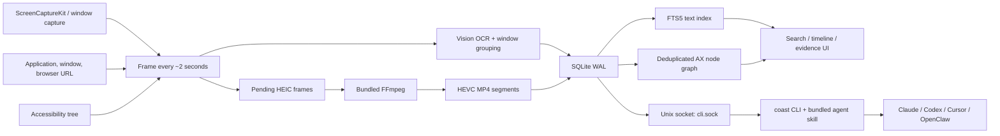

# Coast Local 1.0 (build 131000): reverse-engineering notes

> Snapshot date: 2026-07-30. This is a version-scoped, read-only analysis of
> one installed copy of Coast Local. It is not a claim about earlier or later
> releases.

## Executive summary

Coast Local is a native arm64 Swift/SwiftUI menu-bar application, not an
Electron application. Its central product loop is:

1. capture the screen roughly every two seconds;
2. collect application, window, browser URL, OCR, and optional Accessibility
   context;
3. compact pending HEIC frames into HEVC MP4 segments;
4. index text and metadata in a local SQLite/FTS5 database; and
5. expose the result through its own search/timeline UI and a Unix-socket CLI
   for coding agents.

The installed Lite build is best understood as a high-resolution recall index,
not as a learned personal model. It contains Apple's Vision OCR and a TF-IDF
similarity implementation, but no bundled Core ML, ONNX, GGUF, or other model
asset was found. Claude, Codex, Cursor, or OpenClaw becomes the reasoning layer
after receiving evidence through the bundled `coast` skill.

The main privacy boundary is the signed-in macOS account. The observed
database, pending images, archived video, and TF-IDF cache are plaintext at the
application layer. This matches Coast's current
[privacy policy](https://coast.app/privacy) (updated July 21, 2026), which says
the database is not separately encrypted and recommends FileVault. No evidence
of general screen-recording upload was found in this Lite build, but it does
make or prepare limited outbound requests for updates, analytics, diagnostics,
favicons, and optional newsletter signup. Coast's UI and documentation say
Airgap Mode suppresses telemetry, update checks, and remote favicon requests
after relaunch; that behavior was not runtime-tested.

## Evidence discipline

The report uses three evidence levels:

- **Observed**: reproduced from the installed bundle, runtime, file formats,
  schema, or network cache.
- **Declared**: stated by Coast's current official privacy policy, terms, FAQ,
  or bundled help.
- **Inferred**: a bounded interpretation of static code artifacts or an absence
  of evidence. Inferences are not presented as active behavior.

No screenshot, video frame, OCR text, window title, URL history, AX payload,
credential, or personal database row value was inspected. Runtime checks were
limited to process metadata, open files, file formats, schema, aggregate file
sizes/counts, and network endpoints.

## Build identity and trust

| Property | Observed value |
|---|---|
| Application | `Coast Local` |
| Bundle ID | `inc.attention.rem` |
| Edition | `lite` |
| Version | `1.0` |
| Build | `131000` |
| Internal client version | `client-v00.00.131-lite` |
| Architecture | arm64 only |
| Minimum macOS | 14.6 |
| Developer ID | Attention Engineering, Inc. |
| Team ID | `6U2JW3D8N3` |

The bundle passes strict deep code-signature verification. Gatekeeper reports a
Notarized Developer ID application, although the bundle itself has no stapled
notarization ticket. Hardened Runtime and PIE are enabled.

The main executable is stripped of ordinary defined symbols and has no Mach-O
FairPlay encryption. Swift reflection metadata, source filenames, type names,
UI copy, and imported APIs remain, which makes component-level recovery
relatively straightforward.

## Reconstructed capture and retrieval pipeline



The pipeline is supported by direct framework imports, recovered Swift type and
source names, the live schema, media formats, and bundled CLI help:

- `ScreenCaptureKit`, `CGWindow*`, and capture service types provide pixels and
  window geometry.
- `VNRecognizeTextRequest` and `OCRManager` provide local OCR.
- `BrowserURLService` associates supported browser windows with URLs/domains.
- `AccessibilityTreeBuilder`, `ax_node`, `ax_node_edge`, and `ax_snapshot`
  preserve a content-deduplicated AX tree.
- Pending frames are ordinary HEIC images. Container and codec metadata from
  one archive showed an ordinary HEVC MP4 encoded with
  `hevc_videotoolbox`; the database maps each logical frame to a video and
  frame index.
- FTS5 indexes foreground OCR, background OCR, and titles.
- `TFIDFEmbeddingProvider` supports text-difference sampling and result
  coverage. This is lexical TF-IDF, not a neural embedding model.

The database migrations also show the product's evolution: FTS, Porter
stemming, inactive-frame marking, persistent AX trees, AX-node deduplication,
window URLs, capture-display geometry, and app-version/timezone observations
were added incrementally.

## Local storage model

The production data root is:

```text
~/Library/Application Support/inc.attention.rem/
├── rem.db
├── rem.db-wal
├── rem.db-shm
├── tfidf_cache.json
├── frames/
├── videos/
├── icons/
├── cli.sock
└── coast.instance.lock
```

Other application-owned state is under Preferences, Caches, HTTPStorages, and
Sentry's cache directory.

### Database schema

The observed `rem.db` is a normal SQLite 3 database in WAL mode. It can be
opened by the system `sqlite3` binary without a key. SQLCipher is bundled,
linked, and loaded, but the observed production database does not use
SQLCipher page encryption.

The logical tables are:

| Area | Tables |
|---|---|
| Pixels and timeline | `frame`, `video`, `window_bound`, `segment` |
| OCR and search | `ocr`, `ocr_fts` and FTS shadow tables |
| Accessibility | `ax_legacy_tree`, `ax_node`, `ax_node_edge`, `ax_snapshot` |
| Context | `application`, `domain`, `timezone`, `app_version` |
| Internal state | `metadata`, `once_tasks`, `grdb_migrations` |

Schema-confirmed sensitive fields include:

- foreground and background OCR text;
- frame and window titles;
- browser URLs and normalized domains;
- application identities;
- AX tree payloads and snapshots;
- image/video paths and capture geometry; and
- an FTS5 index over OCR and titles.

`tfidf_cache.json` is also plaintext and contains a derived vocabulary and
inverse-document-frequency values.

### Pixel storage

Pending pixels are regular HEIC files. Compacted archives are regular,
extensionless ISO MP4 files. The inspected segment used an MP4 timebase of one
encoded frame per second; that archive setting is separate from the roughly
two-second wall-clock capture interval. These files are not encrypted
containers.

The current official policy is unusually explicit about this boundary:
recordings stay on the Mac, but the application does not separately encrypt its
database today. Therefore:

- FileVault protects the volume before it is unlocked at login;
- a same-user process with filesystem access can read the data;
- copying the data root produces a directly inspectable history; and
- application-level retention should not be interpreted as forensic secure
  erasure.

No backup-exclusion extended attribute was found on the data root, database,
frame directory, or video directory. Whether the data actually enters Time
Machine or another backup depends on the machine's backup configuration, but
the application does not appear to opt it out.

The policy also says video retention and storage limits can compress or delete
older video while extracted text remains until the application's data is
deleted. A user choosing a short video-retention period should not assume that
OCR, titles, URLs, and FTS terms are removed at the same time.

## CLI and agent boundary

The installer creates:

```text
~/.local/bin/coast
  -> /Applications/Coast Local.app/Contents/Resources/bin/coast
```

The CLI talks to the running application through:

```text
~/Library/Application Support/inc.attention.rem/cli.sock
```

Recovered client/server types and errors indicate newline-delimited JSON over a
Unix domain socket. The public surface includes:

- application/domain enumeration and usage aggregates;
- OCR/title FTS5 search;
- frame metadata and OCR boxes;
- historical screenshot export and focused-window crop;
- AX tree and AX attribute retrieval;
- segment sampling and TF-IDF-based coverage; and
- an immediate current-screen capture command.

Ordinary access to the socket must traverse the owner's `~/Library` tree, whose
parent directory is owner-only on the observed system. This blocks normal
cross-account access, but not root or another privileged principal. No bearer
token or explicit per-client approval appears in CLI help. An application-layer
peer credential or handshake was not tested, so it would be incorrect to claim
that no authentication exists. The practical documented boundary, however, is
the signed-in user account: installing the bundled skill lets a trusted
same-user agent query the history.

The application can detect and route to Claude, Codex, Cursor, and OpenClaw.
It either opens a desktop chat with a prefilled prompt or launches the agent CLI
in a chosen terminal. The agent is expected to invoke Coast's skill and select
the relevant evidence. Data chosen for handoff then falls under the receiving
agent/provider's policy, as Coast's privacy policy notes.

Two minor CLI defects were observed:

- help recommends `coast help <subcommand>`, but the working form is
  `coast <subcommand> --help`; and
- `coast --version` exits successfully without printing a version.

## Network and external services

No TCP/UDP connection or listener was present during several short runtime
samples. That observation does not exclude brief periodic requests. The local
CLI uses a Unix socket; a static `localhost:8969` development/backend string
was not listening during the audit.

| Destination or provider | Purpose | Evidence |
|---|---|---|
| Attention update API | Sparkle appcast and release delivery | Bundle configuration; automatic checks enabled by default |
| TelemetryDeck | Product-usage analytics and aggregate device/app metadata | Bundled SDK/privacy manifest, official policy, and a cached request |
| Sentry | Crash, hang, and diagnostic reporting | Bundled/static configuration and official policy; no payload captured |
| DuckDuckGo favicon service | Website icon lookup | Static endpoint and official policy |
| Loops | Optional newsletter signup | Static form endpoint and a cached request |
| Chosen AI agent/provider | User-directed prompt/evidence handoff | Agent-routing code and official policy |

The favicon lookup is a subtle privacy tradeoff: it discloses the visited domain
and the device IP address to DuckDuckGo when a remote icon is requested. The
bundle includes thousands of common domain icons, which can avoid some lookups,
but does not eliminate the behavior.

Airgap Mode is the strongest built-in egress control. Static UI copy says it
suppresses telemetry, update checks, and remote favicon requests and takes
effect after relaunch. The current [FAQ](https://coast.app/faq) and
[terms](https://coast.app/terms) make the same claim.

No CloudKit linkage, iCloud container, active remote stream, or confirmed
general screen-data upload endpoint was found. That is a medium-confidence
negative result, not proof that every code path is offline.

## Privacy controls recovered from the build

The build contains controls for:

- pause/resume and timed pause;
- pause on user inactivity;
- application, domain, and exclusion-group filters;
- private-browser-tab exclusion;
- password-manager exclusions;
- suppression of notification banners while a messaging app is excluded;
- stripping masked password values from AX data;
- time- and storage-based retention;
- Airgap Mode; and
- disabling CLI access.

The private-tab path deserves care. Static copy says Automation permission lets
Coast read a browser's incognito state directly; otherwise it may infer the
state. The existence of the control should therefore not be interpreted as a
perfect privacy boundary on every browser/configuration.

These are recovered code paths, not a guarantee that every control is enabled
by default or configured correctly on a given machine.

The build and official policy both say Coast does not capture microphone or
camera input. The bundle has no microphone or camera usage description. Its
AVFoundation/CoreAudio linkage alone is not evidence of audio capture.

## Security posture

### Positive controls

- valid Developer ID signature, strict deep verification, and Gatekeeper
  notarization acceptance;
- Hardened Runtime and PIE;
- signed Sparkle updates with an embedded Ed25519 public key;
- owner-directory protection around the data root and CLI socket;
- local storage that can benefit from FileVault protection before volume
  unlock;
- explicit capture exclusions, pause, retention, CLI disable, and Airgap Mode;
  and
- no evidence of a general screen-data sync path in the installed Lite build.

### Residual risks

1. **High-value plaintext corpus.** Pixels, OCR, titles, URLs, and AX state are
   directly readable once a process has same-user filesystem access.
2. **Broad same-user capability.** The CLI intentionally exposes raw images,
   OCR, and AX trees to local agents. There is no visible per-query user
   approval or per-client token in the CLI surface.
3. **No App Sandbox.** The main application is not sandboxed and has Apple
   Events automation plus network client/server capability.
4. **Relaxed code-memory controls.** The main application allows JIT and
   unsigned executable memory. The CLI and some bundled helpers also disable
   library validation. This is attack surface, not by itself an exploitable
   vulnerability.
5. **Backup and deletion ambiguity.** No backup-exclusion marker or verified
   secure-erasure workflow was observed. Retention should be treated as logical
   lifecycle management, not guaranteed media sanitization.
6. **Domain-level egress.** Remote favicon requests can disclose visited
   domains, and analytics/update/diagnostic traffic still exists unless Airgap
   Mode is enabled.

Internal files were generally group/world-readable (`0644`) inside an
owner-only `~/Library` ancestor. This blocks normal cross-account traversal but
does not protect against same-user malware, plugins, or agents. Coast's policy
states the same fundamental limitation.

## Shared or unreachable code signals

The Lite binary contains names and UI copy for database sync, video upload,
delete-after-upload, Auth0, signed-out recording gates, and a "Full" edition.
Its provisioning metadata also retains older/full-edition naming.

Those artifacts suggest a shared codebase or internal/full variant. They do not
establish that the installed Lite product uploads recordings:

- the bundle declares `CoastEdition=lite`;
- the official policy says recordings do not reach Attention;
- no general screen-data upload endpoint or active stream was confirmed; and
- runtime/cache evidence only established limited analytics/newsletter traffic.

These signals should remain a follow-up hypothesis rather than a product claim.

## Product implications for Persome

Coast's strongest design is not a hidden model. It is a low-friction,
high-recall evidence surface:

- native capture;
- searchable OCR plus app/domain/date filters;
- focused-window image and AX retrieval;
- compact segment sampling;
- a simple Unix-socket CLI; and
- one-command skill installation for existing agents.

Those are worth learning from.

The clearest differentiation is:

```text
Coast: raw visual recall that an external agent interprets
Persome: evidence-linked, correctable delegation context that an agent inherits
```

For Persome, the product opportunity is to preserve its
[documented security boundaries](../../SECURITY_PRIVACY.md) while matching
Coast's retrieval ergonomics:

- owner-only `0700`/`0600` storage rather than relying on an owner-only ancestor;
- fail-closed screenshot encryption or omission;
- authenticated local HTTP surfaces and explicit trusted-client boundaries;
- evidence receipts rather than unqualified OCR recall;
- correction, revocation, and forgetting across derived state; and
- a clear distinction between raw capture, inferred memory, and modeled claims.

Coast demonstrates that agent distribution can be a product feature in its own
right. Persome can differentiate by making the handoff smaller, more durable,
more auditable, and safer than exposing selected raw screen-history evidence to
agents.

## Safe reproduction commands

These commands inspect package and schema metadata without reading personal row
values:

```bash
APP="/Applications/Coast Local.app"
DATA="$HOME/Library/Application Support/inc.attention.rem"
DB="$DATA/rem.db"

plutil -p "$APP/Contents/Info.plist"
file "$APP/Contents/MacOS/Coast Local"
shasum -a 256 "$APP/Contents/MacOS/Coast Local"

codesign -d --verbose=4 "$APP"
codesign -d --entitlements :- "$APP"
codesign --verify --deep --strict --verbose=2 "$APP"
spctl -a -vvv --type execute "$APP"
xcrun stapler validate "$APP"

otool -L "$APP/Contents/MacOS/Coast Local"
find "$APP/Contents/Resources" -maxdepth 2 -type f -print

file "$DB"
sqlite3 -readonly "$DB" \
  "SELECT type,name FROM sqlite_schema
   WHERE name NOT LIKE 'sqlite_%' ORDER BY type,name;"
sqlite3 -readonly "$DB" \
  "SELECT m.name,p.cid,p.name,p.type,p.\"notnull\",p.pk
   FROM sqlite_schema m JOIN pragma_table_info(m.name) p
   WHERE m.type='table' AND m.name NOT LIKE 'sqlite_%'
   ORDER BY m.name,p.cid;"

ls -l "$HOME/.local/bin/coast"
"$HOME/.local/bin/coast" --help
lsof -nP -U | rg 'inc\.attention\.rem/cli\.sock'
```

Do not run FTS, frame, image, OCR, or AX queries as part of a package audit
unless inspection of personal activity data is explicitly in scope.
