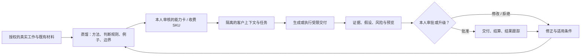

# Persome「蒸馏人去赚钱」市场研究

> 研究日期：2026-07-29
>
> 研究对象：CMO、增长顾问及相邻专家，把自己的判断与工作方法蒸馏成可收费的 AI 专家服务
>
> 产品数据库：[2026-07-29-persome-expert-distillation-product-database.md](./2026-07-29-persome-expert-distillation-product-database.md)

## 0. 一页结论

### 判断

**值得做验证，但不应该从「又一个 AI 分身聊天产品」或「先建专家 marketplace」开始。**

需求不是凭空产生的。人类专家访问、独立顾问、知识付费、AI 分身，已经分别验证了四件事：

1. 企业愿意按通话、项目或订阅购买外部判断；
2. 专家愿意把空余时间、方法和声誉变成收入；
3. 用户愿意为课程、社群、咨询和持续访问专家付费；
4. 专家愿意训练一个 AI 版本，让知识服务不再完全受自己时间限制。

但「把内容喂给聊天机器人，再挂一个付费墙」已经拥挤。Delphi、Coachvox、BuddyPro 等已经直接售卖这件事；GLG 和 AlphaSense/Tegus 则从买方一侧把专家访谈变成 AI 主持、转录、检索和综合。

Persome 更有机会占据的空位不是 **AI clone**，而是：

> **一个由本人拥有、持续从真实工作中更新、能交付具体成果、能说明依据、知道何时把本人叫回来的专家服务。**

第一切口建议选已有客户或已有受众的 CMO / 增长顾问，为每个人只产品化一个高重复、可验收的交付，例如：

- GTM / 定位诊断；
- 增长漏斗诊断与实验 backlog；
- 官网、落地页与 message hierarchy 审计；
- 新产品 launch brief；
- 渠道优先级与预算情景分析。

先做 **B2B2Expert 的 managed service / FDE**，让专家带来需求，避免双边市场冷启动。免费或低价对话只负责获客和采集需求；真正收费的是带客户上下文、证据、范围边界和本人审批的工作成果。

### 最重要的反常识

- **“能像我一样回答”不是高价值终点。** GrowthMentor 已经用约 $50–85/月提供大量真人沟通；纯问答会被真人订阅、通用模型和免费内容同时压价。
- **真正稀缺的是可承担责任的判断。** 买家在意的不只是答案，而是这个答案是否适用于自己的业务、依据是什么、是否用了过期或越权数据、出了问题谁复核。
- **专家的历史工作不是天然可再出售的数据。** 客户资料、雇主资料、第三方版权和保密信息必须在进入可售模型前完成权利过滤。
- **Expert Call 2.0 正在由 incumbent 自己建立。** GLG 已推出 AI-Moderated Calls 和 MCP；AlphaSense 已推出 AI Interviewer。Persome 不能只做“更快获得专家答案”，必须把供给侧所有权、连续蒸馏和交付能力做成差异。
- **第一阶段不需要 marketplace。** 先证明一个专家分身能产生可重复、可安全交付、有人付费的结果；否则 marketplace 只会放大空供给。

### Go / no-go

建议以六周为一轮验证，达到以下最低门槛再扩大投入：

- 5–10 位 CMO / 增长顾问各自选择一个收费 SKU；
- 每位用 20–30 个历史案例做 shadow evaluation；
- 总计产生至少 20 笔真实付费交付；
- 专家首次蒸馏与配置不超过 4 小时；
- 本人一次通过率不低于 80%，关键结论证据覆盖率不低于 90%；
- 已限定范围内，转人工率不高于 20%；
- 零跨客户信息泄漏，零未授权外部动作；
- 至少 25% 买家复购或升级；
- 至少 5 位专家愿意支付 setup fee，或接受持续分成。

若买家只愿意免费聊天、专家重写超过一半内容、没有人愿意为首个完整交付支付至少 $149，或系统无法可靠识别越界请求，应停止做 marketplace，回到更窄的单一工作流。

## 1. 研究问题、口径和证据等级

### 研究问题

本研究回答五个问题：

1. “专家把自己蒸馏出去赚钱”是否对应已有且持续的付费行为？
2. 上一代专家 call / 顾问平台如何组织供需、定价、合规与信任？
3. 新一代 AI 分身、知识商业化和 agent 产品已经做到哪里？
4. CMO / 增长顾问有哪些工作适合被蒸馏、收费和逐步自动化？
5. Persome 应该从什么产品和商业模式切入，如何用最小成本证伪？

### 方法

- 以 2026-07-29 可访问的官网、帮助中心、定价页、监管机构页面、公司新闻稿和产品文档为主要来源；
- 产品数据库覆盖专家网络、顾问 / 导师市场、知识商业化、AI 分身与 agent 基础设施四类产品；
- 对收费、规模、AI 能力和公司状态，不从搜索摘要或二手榜单推断；无法由官方页面确认的项目标为“未公开”“状态待核”或“厂商自述”；
- 用当前 Persome 代码与公开文档校对可用能力，避免把研究建议写成已交付功能；
- 不把专家网络、自由职业、创作者经济等相邻市场规模相加为 TAM。

### 证据限制

“CMO / 增长顾问已经表达蒸馏自己的需求”来自创始人对访谈的转述，是重要的一手早期信号，但本轮无法独立读取访谈原文：飞书文档搜索缺少 `search:docs:read` 授权。因此本文不会把访谈人数、付费意愿或具体措辞当成已经验证的数据。

此前可追溯的屏幕观察只证明团队曾把“蒸馏自己去赚钱”列为 PMF 需求，并在 Follow Bench 中设计了增长顾问的 GTM、目标客户、定位、核心信息、发布、渠道、漏斗、内容、合作、外呼、销售支持、激活和定价测试等任务。它证明了研究方向和任务覆盖，不证明 PMF、收入或已交付能力。

证据标记：

- **事实**：当前官网、产品文档、代码或监管原文可核验；
- **厂商自述**：案例、规模、ROI 或效果来自供应商，未独立审计；
- **创始人信号**：来自本次任务所述访谈，未读取原始记录；
- **推论 / 假设**：本研究给出的产品或商业判断，需要实验验证。

## 2. 需求到底是什么

### 不是一个需求，而是五层需求

| 层级 | 专家想卖什么 | 买家真正买什么 | 已有替代品 | 自动化空间 |
|---|---|---|---|---|
| 1. 信息访问 | “问我一个问题” | 快速获得行业事实或经验 | GLG、Clarity、在行、内容搜索 | 很高，但容易同质化 |
| 2. 方法访问 | “按我的框架思考” | 结构化诊断、检查表、观点 | 课程、社群、Delphi、Coachvox | 高 |
| 3. 情境判断 | “用我的方法处理你的业务” | 结合客户数据的建议与取舍 | 顾问、导师、fractional CMO | 中高，必须有上下文与证据 |
| 4. 工作交付 | “替我完成一份成果” | audit、brief、实验计划、报告 | 独立顾问、agency、agent 工具 | 中，需要工具、权限和复核 |
| 5. 结果责任 | “持续替我经营并对结果负责” | 增长结果、预算回报、组织协调 | 顾问项目、agency、fractional executive | 低，早期必须 human-in-the-loop |

市场已经充分覆盖第一层，开始覆盖第二和第三层，正在争夺第四层。Persome 的机会在 **3 → 4**：不是复制专家说话，而是把专家的决策模式转成受约束的工作流和可验收成果，同时保留本人作为最后责任边界。

### 供给侧 Job-to-be-done

CMO / 增长顾问选择“蒸馏自己”，通常不是因为想拥有一个炫酷 avatar，而是要：

1. 在不增加日历时间的情况下服务更多线索和客户；
2. 把重复解释、需求澄清、基础审计和首次交付自动化；
3. 让低价产品筛选出高价值人工咨询客户；
4. 把散落在项目、文档、会议和操作中的隐性方法沉淀为资产；
5. 保持本人语境、方法、边界和声誉，不被通用 AI 稀释；
6. 即使自己不在线，也能产生合格线索、交付或订阅收入；
7. 看见 AI 代表自己说了什么、依据是什么，并能纠正和撤销。

### 买方 Job-to-be-done

买家不是在购买“一个模型”，而是在购买：

1. 比预约真人更快的响应；
2. 比通用模型更贴合特定专家的方法；
3. 比一门课程更贴合自己的业务；
4. 比传统咨询更低的首次尝试成本；
5. 可复核、可追溯、知道适用边界的建议；
6. 必要时能无缝升级给专家本人，而不用重新解释一次。

### 为什么 CMO / 增长顾问是好切口

- 工作由大量重复框架和少量高风险取舍组成，天然适合分层自动化；
- 结果可以通过文档、漏斗指标、实验设计和后续效果进行评价；
- 顾问往往已有内容、模板、案例、客户与个人分发渠道，降低供给创建和获客成本；
- 客户上下文高度重要，通用聊天机器人难以直接替代；
- 声誉和错误成本高，证据、更新、权限和本人复核可以形成付费理由；
- 一次诊断容易自然升级到人工 workshop、月度顾问或执行项目。

## 3. 从 Expert Call 1.0 到专家服务 Agent

### 市场演化

| 阶段 | 代表产品 | 核心交易单位 | 平台的主要价值 | 局限 |
|---|---|---|---|---|
| Expert Network 1.0 | GLG、AlphaSights、Third Bridge、Guidepoint | 30–60 分钟专家电话 | 招募、筛选、排期、合规 | 同步、昂贵、输出不可复用 |
| 顾问市场 / Mentoring | Catalant、Toptal、Clarity、Intro、GrowthMentor、在行 | 通话、小时、项目、订阅 | 匹配、支付、声誉、项目管理 | 专家时间仍是瓶颈 |
| Knowledge Commerce | Kajabi、Teachable、Substack、知识星球、小鹅通 | 课程、内容、社群、会员 | 分发、订阅、支付 | 静态内容难以适应买方情境 |
| AI Twin 1.0 | Delphi、Coachvox、Personal AI、BuddyPro | 对话、消息额度、订阅 | 内容摄取、人格 / 方法复现、付费墙 | 多数停在问答，工作证据和动作边界弱 |
| Expert Intelligence | AlphaSense/Tegus、GLG AI-Moderated Calls | AI 访谈、转录库、综合报告 | 规模化采集、检索、合规、企业分发 | 资产和买方关系由平台掌握 |
| Expert Service Agent（机会） | 尚未形成稳定领导者 | 客户特定的可验收成果 | 连续蒸馏、执行、证据、审批、结算 | 权利、责任、可信度与工具安全困难 |

Inex One 对行业的厂商估计认为，专家网络在 2025 年约为 30 亿美元，2023–2025 年约增长 12%，行业已有 100 多家网络。这个数字不是审计后的公共市场数据，但可作为“企业确实持续购买外部专家访问”的量级信号，而不是 Persome 的 TAM。[来源](https://inex.one/blog/expert-network-market-size)

更关键的不是总额，而是 incumbent 的产品方向：

- GLG 的 [AI-Moderated Calls](https://glg.com/how-we-help/expert-calls-meetings/ai-moderated-calls) 用 AI 主持结构化、可并行的专家访谈，交付转录与综合；[GLG MCP](https://glg.com/how-we-help/mcp) 进一步把专家内容带进客户的 AI 工具。
- AlphaSense 在收购 Tegus 后推出 [AI Interviewer](https://www.alpha-sense.com/press/alphasense-launches-autonomous-ai-agent-interviewer-debuts-channel-checks-to-deliver-real-time-market-signals-across-all-sectors-of-the-economy/)，以 AI 批量访问专家并把结果进入其研究平台。页面所称访谈量、语料量和投资额均是厂商自述。

这说明需求方向已经从“找人聊”迁移到“把专家知识结构化、可检索、可批量复用”。但现有专家网络大多从买方出发：平台拥有需求、流程和内容库。Persome 可以从供给侧出发，让专家本人拥有模型、授权边界、客户关系和修正权。

## 4. 需求证据与价格锚点

### 人类专家访问仍然有明确价格

| 产品 | 当前可核验的价格 / 机制 | 含义 |
|---|---|---|
| [Clarity](https://clarity.fm/expert) | 官网称平均 30 分钟约 $50；专家自定价，平台收 15% | 快速建议的低端价格锚 |
| [Intro](https://intro.co/experts) | 示例约 $100–$2,000/小时；平台带来的客户抽 30%，专家自带客户抽 10% | 名人 / 高端专家访问仍有高客单 |
| [GrowthMentor](https://www.growthmentor.com/) | 当前页面显示约 $85/月（按季度）或 $50/月（按年）获得大量 1:1 访问；含匹配、录制、转录和 AI recap | 纯问答订阅面临真人供给的价格压力 |
| [Delphi](https://www.delphi.ai/pricing) | 当前定价页显示 Builder / Scaler 创作者保留 85% 收入；可设订阅与付费访问 | “数字分身收费”已是现成能力 |
| [Coachvox](https://support.coachvox.ai/article/72-how-to-get-paid-for-ai-coaching) | 支持一次、周和月付；帮助页建议常见尝试区间约 £10–100/月 | 教练型 AI 分身已有直接变现路径 |
| [BuddyPro](https://buddypro.ai/) | 年费约 $2,364 加使用费；页面建议专家把服务卖到约 $1,997/年 | 高价 white-label AI twin 已存在；效果数字仅为厂商自述 |

### 邻近劳动力需求

Upwork 的 2025 技能报告把 Marketing Strategy 列入销售与营销类前十，把 Management Consulting、Business Analysis & Strategy 列入咨询类前十；其调查称 49% 企业借助自由职业者填补技能缺口，48% CEO 计划增加自由职业招聘。数据来自 Upwork 平台和其研究口径，只能证明在线独立专业工作有需求，不能直接换算成 AI 专家服务需求。[来源](https://www.upwork.com/press/releases/upwork-unveils-2025s-most-in-demand-skills)

Mayple 则把营销顾问服务做成受管理的垂直市场：由 AI 匹配营销专家，并查看过去广告账户和成果进行审核，持续管理交付。[来源](https://www.mayple.com/platform-overview) 这揭示买方为增长建议付费时的真正障碍：不是找不到“会说增长的人”，而是难以判断谁真的做过、建议是否适合自己、交付是否持续达标。

### 不应相加的相邻市场

下列数据只说明支出池存在，不应相加成 Persome TAM：

- 专家网络：约 30 亿美元的 2025 厂商估计；
- 灵活数字知识工作：Upwork 委托研究给出的广义预测；
- 知识商业化：Kajabi 所称创作者累计收入、Substack 的付费订阅数；
- 独立咨询与营销服务：Catalant、Toptal、Mayple、fractional CMO 等项目支出。

真正的可服务市场必须由“多少现有专家能上线一个合格 SKU × 每个 SKU 能产生多少软件收入与交易额”自下而上估算。

## 5. 竞争格局：谁最接近

完整的逐产品数据库单独收录。这里按战略威胁排序。

| 竞争者 | 已验证的核心能力 | 与 Persome 的重叠 | 关键缺口 / 可攻击点 |
|---|---|---|---|
| [BuddyPro](https://buddypro.ai/) | 为专家 / 教练 / 顾问建立 white-label AI twin，摄取方法与内容，长期记忆，Stripe 收费 | 最直接的“蒸馏并赚钱”竞品 | 公开页以问答和授权给客户为主；连续工作蒸馏、逐结论证据和权限模型不清；规模 / 收入为厂商自述 |
| [Delphi](https://www.delphi.ai/) | 上传文档、网站、社交、音视频；数字心智对话、引用、分发和收费 | 强大的创建、分发、变现闭环 | 主要从已整理内容摄取；客户特定工作交付、跨项目隔离和工具动作不是主要叙事 |
| [Coachvox](https://coachvox.ai/) | 面向 coach / creator 的官方 AI 版本，内容训练、品牌化、内置付费 | 最快可替代简单教练问答 | 偏 lead generation / AI coaching；复杂 B2B 交付、来源与审计较弱 |
| [cl0ne.ai](https://cl0ne.ai/) | 落地页宣称本地观察顾问工作流并操作邮箱、文档、CRM、发票等 | “学会本人工作并交付”的叙事最接近 | 目前下载、定价、条款等多数链接只是页内锚点；真实可用性无法核验，所有效果数字均为厂商自述 |
| [Personal AI](https://www.personal.ai/you-own) | 强调个人拥有的持久记忆与私有模型 | 所有权、长期记忆、本人控制 | 当前官网更偏企业 / 通信基础设施，专家交易和付费服务不是核心 |
| [GLG](https://glg.com/how-we-help/expert-network) | 全球专家供给、企业需求、合规、AI 主持访谈、MCP | 买方分发、信任与合规壁垒很强 | 专家不是主要资产所有者；不是专家自己运营可持续 AI 服务 |
| [AlphaSense/Tegus](https://help.alpha-sense.com/hc/en-us/articles/43785894151699-Introduction-to-Tegus-Expert-Transcript-Library) | 大规模专家转录库、检索、综合和 AI Interviewer | 把专家判断变成可复用企业研究资产 | 以投资 / 市场情报为中心；供给侧品牌和工作流不属于专家本人 |
| [GrowthMentor](https://www.growthmentor.com/) | 大量增长导师、订阅访问、AI 匹配、录制 / 转录 / recap | 直接覆盖 CMO / 增长问答 | 真人时间仍是主体，但价格足以压低纯 AI 问答 |
| [Clarity](https://clarity.fm/) / [Intro](https://intro.co/) | 专家自定价、预约、支付、平台抽成 | 交易和人工升级路径 | 没有连续蒸馏与自动交付 |
| [Pickaxe](https://pickaxe.co/) / [MindStudio](https://www.mindstudio.ai/) | 专家可快速制作、嵌入、收费 AI app / agent | 低成本替代“为每位专家搭一个 bot” | 不天然形成持续个人模型、权利过滤和跨客户证据 |
| [Mayple](https://www.mayple.com/) | 垂直营销专家匹配、过往结果验证、交付监控 | 直接争夺增长服务预算 | 人仍执行；但其数据验真与质量管理是 Persome 必须学习的买方信任层 |

### 四个竞争维度

| 维度 | 人类专家网络 | AI twin SaaS | 通用 agent builder | Persome 应占的位置 |
|---|---|---|---|---|
| 专家模型归谁 | 平台 / 内容库 | 通常创作者账户 | builder 账户 | 专家本人可导出、可撤销 |
| 知识如何更新 | 新电话 / 新转录 | 手工上传内容 | 手工 prompt / workflow | 经授权从真实工作持续蒸馏，本人纠正 |
| 卖什么 | 时间和访谈 | 对话和访问 | 一段自动化 | 客户特定、可验收的工作成果 |
| 为什么可信 | 招募、合规、品牌 | 创作者本人背书 | 工具与流程 | 证据、时间有效性、适用范围、审批与审计 |
| 客户数据 | 平台项目空间 | 常见为同一 bot 上下文 | 依实现而定 | 每客户隔离、可删除、默认不反哺公共模型 |
| 人何时介入 | 整场通话 | 通常另约咨询 | workflow 异常 | 高风险决策、越界、低置信和最终签发 |

### 真正的白空间

竞品普遍能够回答“专家过去公开说过什么”。较少产品同时做到：

1. 从本人日常工作中持续提炼，而不是只摄取已发布内容；
2. 把事实、推论、偏好、方法和客户秘密分开；
3. 每项可售能力都有来源权利、适用范围、时间和禁用边界；
4. 在隔离的客户上下文中执行一项任务，而不是只聊天；
5. 输出带证据、假设、置信度、预览和升级理由；
6. 专家能逐项接受、修改、撤销，修正会改善下一次交付；
7. 专家随时把客户接回来，并继承完整上下文。

这些不是一个更长的 system prompt 能解决的问题，而是数据模型、权限、评测和责任流程。

## 6. CMO / 增长顾问：该蒸馏什么

### 工作分层

| 级别 | 适合首轮自动化 | 必须本人审批 | 早期不应自动执行 |
|---|---|---|---|
| Intake | 需求澄清、资料清单、目标 / 指标 / 约束收集、线索资格判断 | 重大范围与报价例外 | 承诺客户结果或合同条件 |
| Research | 公开市场 / 竞品扫描、现有材料归纳、证据缺口 | 采用未经验证的关键事实 | 获取或混用未授权私有资料 |
| Diagnosis | 官网 / 定位 / 漏斗 first pass、问题树、假设清单 | ICP 选择、定位取舍、根因结论 | 把相关性表述为因果 |
| Planning | message hierarchy、launch brief、实验 backlog、优先级初稿 | 渠道取舍、价格测试、预算与资源配置 | 自主移动广告预算或承诺资源 |
| Production | brief、复盘、周报、销售支持材料初稿 | 对外发布、品牌主张、客户最终交付 | 未经预览发送邮件、发帖或改生产账户 |
| Learning | 比较建议与结果、记录修正、更新适用条件 | 将客户案例一般化为可售方法 | 跨客户训练或泄漏原始数据 |

### 推荐首个 SKU：GTM / 定位诊断

**买家输入**

- 产品、目标客户与当前阶段；
- 官网 / deck / 客户研究 / 漏斗数据；
- 目标、预算、时间和不可改变的约束；
- 可被分析的数据授权。

**AI 专家分身交付**

1. 当前 ICP、category、problem、promise 和 proof 的结构化还原；
2. 证据与矛盾清单；
3. 最重要的 3–5 个定位 / 漏斗问题；
4. 每个问题对应的专家方法、适用条件和已知限制；
5. 优先实验、预计学习目标和停止条件；
6. 需要本人判断或客户补充的数据；
7. 专家审批后的最终版本。

**为什么先做它**

- 是用户已设计的增长顾问任务集中心；
- 价值高于单次回答，又不需要直接操作广告账户；
- 输入、过程和输出都能保留证据；
- 可从低价诊断升级到真人 workshop、fractional CMO 或执行项目；
- 能用历史案例做离线评分。

### 不建议的首个 SKU

- “跟我的 AI 随便聊”：差异小、价格低、难衡量结果；
- “全自动 CMO”：范围过大，错误、权限和责任不可控；
- “自动投广告 / 自动发帖”：动作风险高，且不属于当前 Runtime 边界；
- “把所有专家放进 marketplace”：在供给质量和单个 SKU 未验证前制造双边冷启动；
- “永久复制一个人”：法律、伦理和产品承诺都过度，应强调本人控制、可撤销和持续更新。

## 7. 产品定义：Owner-governed Expert Service

### 产品飞轮

### 必须分开的五层数据

1. **Private source model**：专家本人的原始工作上下文，只在授权环境中存在；
2. **Generalizable playbook**：从工作中提炼、经本人批准、可跨客户复用的方法；
3. **Published capability card**：买家能看见的服务范围、输入、输出、价格、时效和拒绝条件；
4. **Client capsule**：每个客户独立的事实、文件、目标和对话，默认不反哺公共模型；
5. **Delivery ledger**：每次交付引用了什么、谁批准、做了什么动作、结果和纠正是什么。

绝不能把“专家记得客户 A 的秘密”误当成“专家模型更聪明”，再带入客户 B。

### 信任界面

买家看到的不是内部 Personal Model，而是一个可理解的服务契约：

- 这是 AI，背后对应哪位专家；
- 能做什么、明确不能做什么；
- 使用哪些已授权来源和客户材料；
- 关键结论的证据与更新时间；
- 哪些内容由 AI 生成，哪些由本人复核；
- 何时升级给本人；
- 客户数据的保留、删除和训练规则；
- 价格、退款、交付时限和责任边界。

### 当前 Persome Runtime 能力与新增产品层

当前仓库能够支持的底层原语包括：本地优先的屏幕 / AX 上下文采集、时间线和 session、增量建模、证据 receipts、bitemporal 历史、显式纠正、导出 / 删除、localhost viewer、REST 与 MCP。它不等于一个已经可售卖的专家 marketplace。

| Runtime 已有或已有公开契约 | 下游商业产品仍需建设 |
|---|---|
| 授权采集、时间线、Point / Line / Face / Volume / Root | 专家服务创建器与能力卡 |
| 证据、来源、历史、纠正和遗忘 | 权利过滤、可发布 projection / compiler |
| 本地 viewer、REST、MCP | 客户 portal、client capsule 与交付模板 |
| 本地 owner token / capability | 多租户认证、计费、结算与税务 |
| Personal Model 查询 | 任务生命周期、审批、SLA、人工升级 |
| 不执行任务的安全边界 | 受限工具动作、预览、回滚与审计 |
| 当前模型评测原语 | SKU 级 outcome eval、泄漏测试与 buyer feedback |

因此，建议把变现产品作为独立的 downstream service，Runtime 继续保持本地个人模型与证据边界，不把支付、买家 dashboard 或通用 computer-use 混进 public Runtime。

## 8. 商业模式和价格

### 首阶段：专家自带分发，Persome 收软件 + 服务费

建议顺序：

1. **Design partner setup**：为专家蒸馏一个 SKU、建立测试集、权利审查和上线；
2. **SaaS**：持续更新、托管、分析、审计、客户隔离和人工升级；
3. **GMV take rate**：对平台结算的交易收取小比例；
4. **Marketplace**：只有在出现可比较的 SKU、稳定质量和复购后才增加平台分发抽成；
5. **Enterprise expert deployment**：给顾问公司、专家网络或软件平台部署其私有专家服务。

### 定价实验，不是市场事实

| 产品层 | 首轮测试价 | 目的 |
|---|---:|---|
| 公开 intake / 资格判断 | 免费或 $0–29 | 获客、收集上下文、筛选需求 |
| 快速评分 / 单点 audit | $29–79 | 验证即时小额支付 |
| AI 专家完整诊断 | $149–499 | 核心异步 SKU |
| 本人审批的高价值交付 | $500–1,500 | 验证 AI + expert 的混合毛利 |
| 真人 workshop / 顾问升级 | 沿用专家现价 | 保留高价值和复杂责任 |
| 专家 design partner | $2,000–5,000 setup | 验证供给侧是否把蒸馏当资产 |
| 持续软件费 | $199–499/月 | 覆盖更新、托管、分析和支持 |
| 交易费 | 5–15% GMV | 低于纯 marketplace 高抽成，换支付与分发 |

Clarity 的 15%、Intro 的 10% / 30%、Delphi 的 15% 和 Mayple 等 managed marketplace 提供了抽成参照。但初期没有平台买方流量时，不应收“分发溢价”；setup 和软件价值更诚实。

### 自下而上情景

以下只是可算的里程碑，不是预测或 TAM：

| 活跃专家数 | 每位软件费 | 每位月 GMV | 平台抽成 | 年软件收入 | 年交易收入 | 合计 |
|---:|---:|---:|---:|---:|---:|---:|
| 100 | $299/月 | $2,000 | 10% | $358,800 | $240,000 | $598,800 |
| 1,000 | $299/月 | $2,000 | 10% | $3,588,000 | $2,400,000 | $5,988,000 |

真正需要先验证的不是“市场够不够大”，而是每位专家是否能持续产生 $2,000 月 GMV、交付毛利是否为正、买家是否复购。

### 单笔交付应跟踪的成本

- 模型、搜索、OCR / 转录和工具调用成本；
- 专家首次配置与每次审批时间；
- 运营质检、退款和争议处理；
- 客户数据隔离、存储和删除；
- 销售与支付手续费；
- 错误交付、品牌损害和合规事件的预期成本。

若 $149 的诊断仍需要专家 60 分钟重写，它不是 AI 产品，只是低价导流。

## 9. 六周证伪计划

### Week 0–1：锁定一个可卖交付

- 选择 5–10 位已有真实客户 / 受众的 CMO 或增长顾问；
- 每位只选一个高频、过去至少做过 10 次的交付；
- 收集 20–30 个历史案例，只使用拥有权利或完成脱敏的材料；
- 让专家写清楚：好答案、坏答案、红线、缺数据时的做法、必须升级本人的情形；
- 给每个 SKU 建 capability card、输入 schema、输出 schema 和评分 rubric。

### Week 2：蒸馏与离线评测

- 从历史工作提炼方法、判断规则、反例和适用边界；
- 保留 20% 案例做 holdout，不用于蒸馏；
- 对每个结论检查来源、时间、客户隔离和权利；
- 专家盲评 AI 结果与自己历史交付，不只评“像不像我”。

### Week 3：Shadow mode

- AI 在真实新需求上生成，但不直接给客户；
- 对比专家最终版本，计算接受率、编辑距离、漏项和升级判断；
- 把失败分成知识缺失、客户数据缺失、推理错误、过期、越权和产品边界错误。

### Week 4–5：真实付费 concierge

- 每位专家用自己的渠道招募 3–5 位买家；
- 客户明确知道 AI 参与，最终交付由本人抽样或逐项批准；
- 测试 $149–499 的核心 SKU 和人工升级；
- 记录从 intake 到交付的时间、成本、本人分钟数和客户下一步。

### Week 6：决定是否产品化

同时过三道门：

1. **供给门**：专家配置 ≤4 小时，愿意付 setup / SaaS 或接受分成；
2. **质量门**：本人通过率 ≥80%，关键证据覆盖 ≥90%，编辑量可持续；
3. **需求门**：≥20 笔付费，≥25% 复购 / 升级，买家为成果而不是新奇付费。

### 核心指标

| 维度 | 指标 |
|---|---|
| 专家价值 | 每月新增收入、节省小时、人工升级收入、专家留存 |
| 买家价值 | 转化、交付时长、复购 / 升级、退款、结果采纳 |
| 模型质量 | 本人接受率、编辑距离、错误类型、范围识别、过期错误 |
| 可信度 | 关键结论证据覆盖、无依据断言、AI / 人工披露准确率 |
| 安全 | 跨客户泄漏、越权工具调用、敏感信息、撤销 / 删除成功率 |
| 经济性 | 单次推理成本、人工复核分钟、运营成本、贡献毛利 |

### Kill criteria

- 真实客户只愿意使用免费对话；
- 没有人愿意为完整交付支付至少 $149；
- 专家需要重写超过 50% 的关键内容；
- 模型无法稳定判断“这不是我能负责的范围”；
- 客户历史材料的权利和保密约束使训练素材无法合法使用；
- 每位专家都需要完全不同的定制系统，无法形成复用的产品 primitive；
- 复购只来自专家本人不断人工服务，AI 没有降低交付边际成本。

## 10. 信任、合规和产品红线

### 主要风险

| 风险 | 失败方式 | 产品控制 |
|---|---|---|
| 冒充与披露 | 买家误以为在和真人沟通 | 首屏、交付物和对外消息持续标记 AI；展示本人复核状态 |
| 客户秘密 | A 客户数据进入 B 客户或公共模型 | client capsule 强隔离、默认不训练、可删除、泄漏测试 |
| 雇主 / 第三方权利 | 专家上传无权再利用的案例、课程或文档 | 来源声明、权利标签、allowlist、发布前扫描与人工确认 |
| 过期判断 | 旧方法被当作当前事实 | bitemporal 状态、freshness、过期提示、需要实时核验的规则 |
| 品牌损害 | 分身越界、过度承诺或表达错误 | 能力卡、拒绝、预览、撤销、全量日志、本人 kill switch |
| 高影响动作 | 自主花钱、发消息、改客户系统 | 早期不自动执行；后续逐动作授权、预览和回滚 |
| MNPI / 合规 | 专家网络式交流触及内幕或保密信息 | 预筛选、项目冲突、禁止主题、实时中止和记录 |
| 数字肖像 / 声音 | 未经同意复制、转让或永久使用 | 明示同意、用途与期限、不可转授权默认、终止后删除 |

### 当前监管信号

- 中国《人工智能生成合成内容标识办法》已于 2025-09-01 生效，要求对生成合成内容设置显式和隐式标识，并规定传播平台与用户相关义务。[官方原文](https://www.cac.gov.cn/2025-03/14/c_1743654684782215.htm)
- 欧盟 AI Act 的透明度义务将从 2026-08-02 起适用于聊天 AI、deepfake 和部分公共利益文本，包含告知用户与机器可读标记等要求。[欧盟委员会说明](https://digital-strategy.ec.europa.eu/en/policies/guidelines-transparency-ai-generated-content)
- 美国 FTC 已有针对政府与企业冒充的规则；“个人冒充”扩展曾以提案形式推进，不能把提案误写成已经生效的全面个人数字分身法。[FTC 规则说明](https://www.ftc.gov/business-guidance/blog/2024/02/new-impersonator-rule-gives-ftc-powerful-tool-protecting-consumers-businesses)
- 美国版权局建议建立联邦数字复制品保护制度；这是政策建议，不是现行统一联邦数字复制品法。[美国版权局](https://www.copyright.gov/newsnet/2024/1048.html)

这不是法律意见。正式上线前需要按目标市场、专家所在地、买家所在地和处理的数据类型做专项法律评估。

### 产品红线

早期版本不得：

- 未披露地假装专家本人在线；
- 把客户资料用于训练可售公共分身；
- 自动花费预算、发送外部邮件 / 私信、发帖或签订承诺；
- 生成无法追到来源的高风险事实；
- 在本人离开后继续永久使用其姓名、声音、形象或方法；
- 将雇主、客户或付费内容直接“蒸馏”成可转售知识；
- 用“本人已审核”描述只做抽样或从未看过的交付。

## 11. 建议的产品与市场顺序

### Phase 1：Expert SKU Studio（0–3 个月）

- 5–10 位 design partners；
- 每位一个 SKU；
- concierge onboarding、历史案例评测和人工批准；
- 专家自带分发；
- 目标是证明付费、质量和边际时间，而不是规模。

### Phase 2：Owned storefront + human escalation（3–6 个月）

- 专家自己的公开 service card、checkout 和客户 portal；
- 可配置 intake、输出、价格和 SLA；
- AI 交付与真人升级共用上下文；
- 客户隔离、删除、评价和结果回传；
- SaaS + 交易费。

### Phase 3：Expert Service OS（6–12 个月）

- 多 SKU、模板和行业评测；
- 受限工具连接器、逐动作审批；
- 专家团队 / 顾问公司的版本、质量审阅和分账；
- 与 CRM、顾问 marketplace 或 expert network 合作分发。

### Phase 4：Marketplace（满足条件后）

仅在以下条件同时成立时再建：

- 至少 50 个活跃、质量可比较的 SKU；
- 单个 SKU 有稳定复购和正贡献毛利；
- 平台能根据客户情境匹配能力，而不只是匹配人物标签；
- 有足够买方流量，抽成能由真实分发价值解释；
- 争议、退款、身份和合规运营已经产品化。

## 12. 定位建议

### 面向专家

> 把你做过的 GTM 决策蒸馏成一个会交付、会说明依据、知道何时把你叫回来的 AI 版本。你卖的不是更多聊天时间，而是可复用的判断和工作成果。

### 面向买家

> 先用专家的方法完成一份针对你业务的诊断；需要承担取舍时，再把完整上下文交给专家本人。

### 类别语言

早期使用买家已经懂的类别：

- AI 专家分身；
- 专家服务自动化；
- AI-powered consulting deliverable；
- Expert Call 2.0。

不急于创造难解释的新名词。差异放在副标题和产品证明：**owned、continuously distilled、evidence-linked、client-isolated、human-governed、work-delivering**。

### 不要使用的承诺

- “永生数字人”；
- “完整复制你”；
- “全自动替你做 CMO”；
- “读取你的一切，所以最懂你”；
- “零人工、永久被动收入”。

这些承诺同时放大权限、可信度和责任风险，也不符合当前 Runtime 已验证的能力边界。

## 13. 最终建议

1. **继续推进，但把项目定义为付费交付实验，不是 clone demo。**
2. **第一批只选已有分发和历史案例的 CMO / 增长顾问。**
3. **用一个窄 SKU 验证 $149–499 的异步成果，再卖人工升级。**
4. **专家模型保持私有；只发布本人批准的能力投影，不发布原始 Personal Model。**
5. **把证据、时间有效性、客户隔离、本人审批和撤销做成体验主干，不做后台合规附件。**
6. **用现有 Runtime 做持续蒸馏与纠正底座；支付、客户 portal、任务 / 审批和工具执行留在 downstream 产品。**
7. **六周后只看真实付费、本人分钟、复购和安全数据；不要用对 demo 的兴奋代替需求。**

一句话：**上一代平台卖专家的一小时，AI 分身产品卖专家的回答；Persome 应该卖由专家拥有并治理的、可重复交付的判断。**
